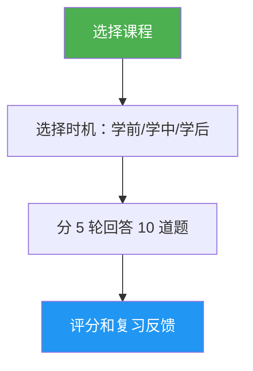

# 课程测验

> 交互式测验，测试你对特定 Claude Code 课程的理解，包含 10 道题目、逐题反馈和针对性复习指导。

## 特色

- 每课 10 道题目，混合概念理解和实际应用
- 覆盖全部 10 节课（01-斜杠命令（Slash Command）到 10-命令行界面（CLI））
- 三种计时模式：预测试、进度检查或掌握验证
- 逐题反馈，提供正确答案和解释
- 针对性复习建议，指向课程的具体章节
- 所有课程共 100 道题库，位于 `references/question-bank.md`

## 使用时机

| 你可以这样说... | 技能（Skill）会... |
|---|---|
| "quiz me on hooks" | 运行关于第 06 课：钩子（Hook）的 10 道题测验 |
| "lesson quiz 03" | 测试你对第 03 课：技能（Skill）的知识 |
| "do I understand MCP" | 评估你对第 05 课：模型上下文协议（MCP）的理解 |
| "practice quiz" | 让你选择一节课，然后进行测验 |

## 工作原理



## 用法

```
/lesson-quiz [课程名称或编号]
```

示例：
```
/lesson-quiz hooks
/lesson-quiz 03
/lesson-quiz advanced-features
/lesson-quiz           # （提示选择课程）
```

## 输出

### 成绩报告
- 总分（满分 10 分）和等级（已掌握 / 熟练 / 进步中 / 入门）
- 按题目类别分类（概念题 vs 实践题）

### 逐题反馈
对于每道错题：
- 你的答案 vs 正确答案
- 正确答案的解释
- 需要复习的具体课程章节

### 时机感知指导
- **预测试**：建立基准，标出学习时需要重点关注的领域
- **学中**：识别你已掌握的内容和需要回顾的部分
- **学后**：确认掌握程度或指出剩余知识缺口

## 资源

| 路径 | 描述 |
|---|---|
| `references/question-bank.md` | 100 道预设题目（每课 10 道），含答案、解释和复习指引 |
