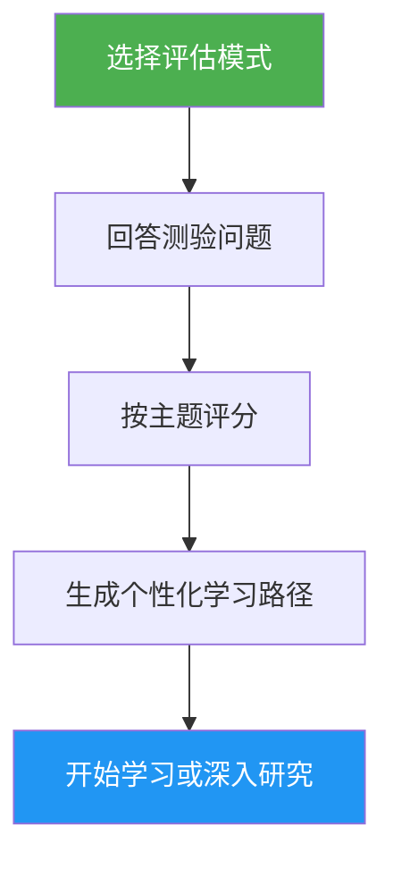

# 自我评估与学习路径顾问

> 全面的 Claude Code 技能评估，评估 10 个功能领域，识别技能缺口，并生成个性化学习路径帮助你提升。

## 特色

- 两种评估模式：快速（8 道题，2 分钟）和深度（5 轮，5 分钟）
- 评估 10 个功能领域：斜杠命令（Slash Command）、记忆（Memory）、技能（Skill）、钩子（Hook）、模型上下文协议（MCP）、子代理（Subagent）、检查点（Checkpoint）、高级功能、插件（Plugin）、命令行界面（CLI）
- 按主题评分，含掌握等级（无 / 基础 / 熟练）
- 缺口分析，支持依赖感知的优先级排序
- 个性化学习路径，包含具体练习和成功标准
- 后续操作：开始学习、深入研究、练习项目或重新评估

## 使用时机

| 你可以这样说... | 技能会... |
|---|---|
| "assess my level" | 运行评估测验并确定你的等级 |
| "where should I start" | 评估你的经验并建议起点 |
| "check my skills" | 生成涵盖全部 10 个领域的详细技能画像 |
| "what should I learn next" | 识别缺口并构建优先学习路径 |

## 工作原理



## 评估模式

### 快速评估（约 2 分钟）
- 2 轮共 8 道是/否经验问题
- 确定总体等级：初学者 / 中级 / 高级
- 列出具体缺口及教程链接
- 适合：首次使用者、快速自查

### 深度评估（约 5 分钟）
- 5 轮问题覆盖 10 个功能领域（每轮 2 个主题）
- 按主题评分（每项 0-2 分，总分 20 分）
- 掌握度表格，含优势领域、优先缺口和复习项目
- 依赖感知的学习路径，含阶段和时间估计
- 推荐结合缺口主题的练习项目
- 适合：希望提升的有经验用户、定期技能复查

## 用法

```
/self-assessment
```

## 输出

### 技能画像表
显示按主题的分数、掌握等级和状态（学习 / 复习 / 已掌握）。

### 个性化学习路径
- 按依赖顺序组织成阶段
- 每个主题包含：教程链接、重点领域、关键练习、成功标准
- 根据已掌握的主题调整时间估计
- 结合多个缺口领域的练习项目

### 后续操作
查看结果后，可选择：
- 通过引导练习开始第一个缺口教程
- 深入研究某个特定缺口领域
- 设置覆盖你缺口的练习项目
- 用不同评估模式重新评估
