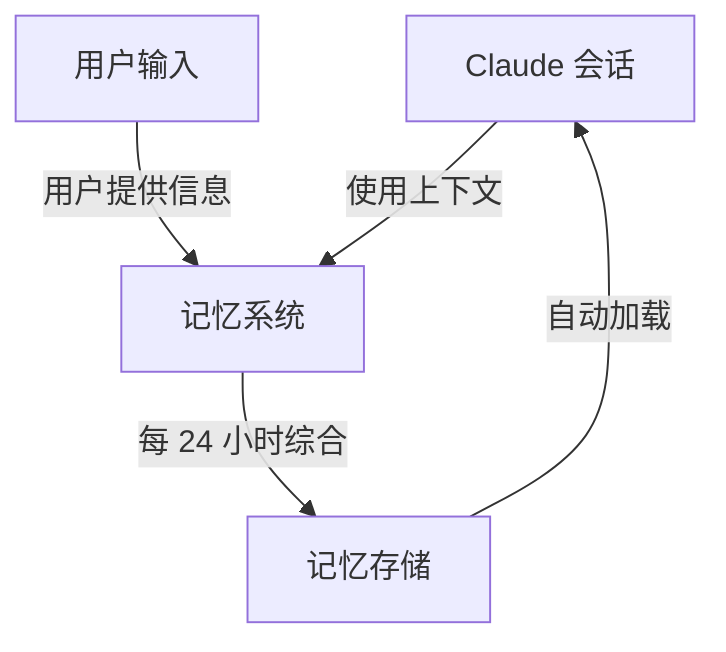
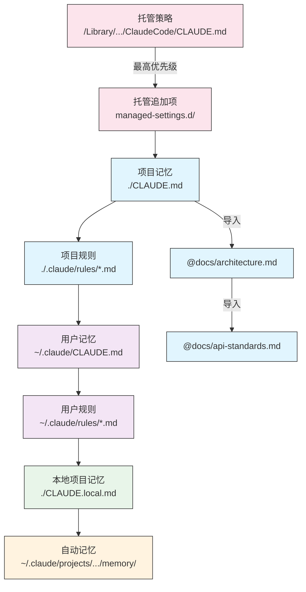
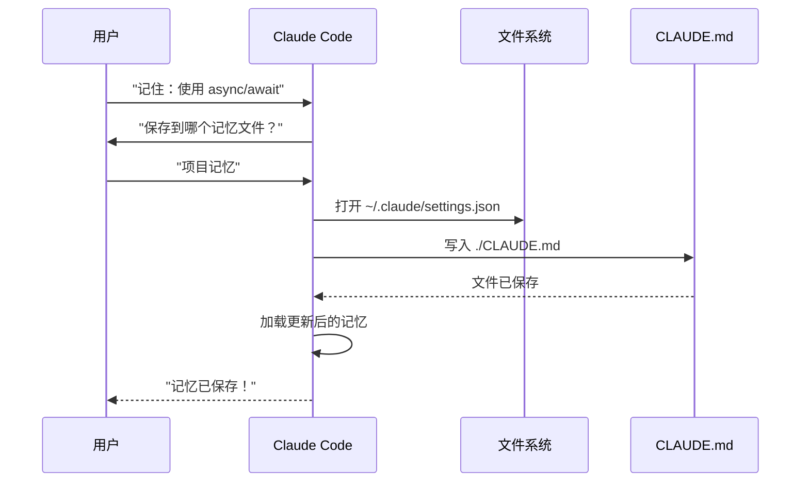
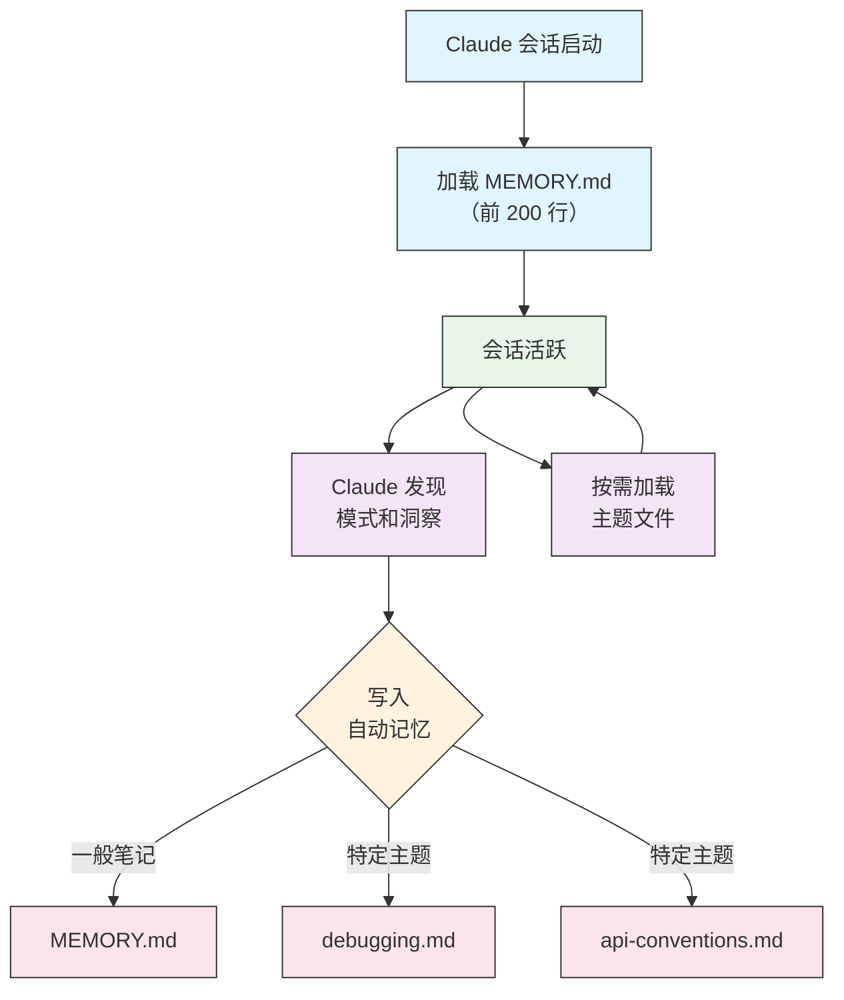

<picture>
  <source media="(prefers-color-scheme: dark)" srcset="../resources/logos/claude-howto-logo-dark.svg">
  
</picture>

# 记忆（Memory）指南

记忆使 Claude 能够跨会话和对话保留上下文。它以两种形式存在：claude.ai 中的自动综合，以及 Claude Code 中基于文件系统的 CLAUDE.md。

## 概述

Claude Code 中的记忆提供了跨多个会话和对话的持久化上下文。与临时的上下文窗口（Context Window）不同，记忆文件允许你：

- 在团队中共享项目标准
- 存储个人开发偏好
- 维护特定目录的规则和配置
- 导入外部文档
- 将记忆作为项目的一部分进行版本控制

记忆系统在多个层级运作，从全局个人偏好到特定子目录，允许对 Claude 记住什么以及如何应用这些知识进行细粒度控制。

## 记忆命令快速参考

| 命令 | 用途 | 用法 | 使用时机 |
|---------|---------|-------|-------------|
| `/init` | 初始化项目记忆 | `/init` | 开始新项目，首次设置 CLAUDE.md |
| `/memory` | 在编辑器中编辑记忆文件 | `/memory` | 大量更新、重组、审查内容 |
| `#` 前缀 | 快速添加单行记忆 | `# Your rule here` | 在对话中快速添加规则 |
| `# new rule into memory` | 显式添加记忆 | `# new rule into memory<br/>Your detailed rule` | 添加复杂的多行规则 |
| `# remember this` | 自然语言记忆 | `# remember this<br/>Your instruction` | 对话式记忆更新 |
| `@path/to/file` | 导入外部内容 | `@README.md` 或 `@docs/api.md` | 在 CLAUDE.md 中引用现有文档 |

## 快速入门：初始化记忆

### `/init` 命令

`/init` 命令是在 Claude Code 中设置项目记忆的最快方式。它使用基础项目文档初始化一个 CLAUDE.md 文件。

**用法：**

```bash
/init
```

**它做了什么：**

- 在项目中创建新的 CLAUDE.md 文件（通常在 `./CLAUDE.md` 或 `./.claude/CLAUDE.md`）
- 建立项目约定和准则
- 为跨会话的上下文持久化奠定基础
- 提供用于记录项目标准的模板结构

**增强交互模式：** 设置 `CLAUDE_CODE_NEW_INIT=true` 启用多阶段交互式流程，逐步引导你完成项目设置：

```bash
CLAUDE_CODE_NEW_INIT=true claude
/init
```

**使用 `/init` 的时机：**

- 开始使用 Claude Code 的新项目
- 建立团队编码标准和约定
- 创建代码库结构文档
- 为协作开发设置记忆层级

**示例工作流：**

```markdown
# 在项目目录中
/init

# Claude 创建包含以下结构的 CLAUDE.md：
# Project Configuration
## Project Overview
- Name: Your Project
- Tech Stack: [Your technologies]
- Team Size: [Number of developers]

## Development Standards
- Code style preferences
- Testing requirements
- Git workflow conventions
```

### 使用 `#` 快速更新记忆

你可以在任何对话中以 `#` 开头的消息来快速添加信息到记忆中：

**语法：**

```markdown
# Your memory rule or instruction here
```

**示例：**

```markdown
# Always use TypeScript strict mode in this project

# Prefer async/await over promise chains

# Run npm test before every commit

# Use kebab-case for file names
```

**工作原理：**

1. 消息以 `#` 开头，后跟你的规则
2. Claude 将其识别为记忆更新请求
3. Claude 询问更新哪个记忆文件（项目或个人）
4. 规则被添加到相应的 CLAUDE.md 文件
5. 未来的会话自动加载此上下文

**替代模式：**

```markdown
# new rule into memory
Always validate user input with Zod schemas

# remember this
Use semantic versioning for all releases

# add to memory
Database migrations must be reversible
```

### `/memory` 命令

`/memory` 命令提供在 Claude Code 会话中直接编辑 CLAUDE.md 记忆文件的入口。它在系统编辑器中打开记忆文件以进行全面编辑。

**用法：**

```bash
/memory
```

**它做了什么：**

- 在系统默认编辑器中打开记忆文件
- 允许进行大量的添加、修改和重组
- 提供对层级中所有记忆文件的直接访问
- 让你管理跨会话的持久化上下文

**使用 `/memory` 的时机：**

- 审查现有记忆内容
- 大量更新项目标准
- 重组记忆结构
- 添加详细的文档或准则
- 随项目发展维护和更新记忆

**`/memory` 与 `/init` 的比较**

| 方面 | `/memory` | `/init` |
|--------|-----------|---------|
| **用途** | 编辑现有记忆文件 | 初始化新的 CLAUDE.md |
| **使用时机** | 更新/修改项目上下文 | 开始新项目 |
| **操作** | 打开编辑器进行修改 | 生成起始模板 |
| **工作流** | 持续维护 | 一次性设置 |

**示例工作流：**

```markdown
# 打开记忆进行编辑
/memory

# Claude 展示选项：
# 1. Managed Policy Memory
# 2. Project Memory (./CLAUDE.md)
# 3. User Memory (~/.claude/CLAUDE.md)
# 4. Local Project Memory

# 选择选项 2（项目记忆）
# 默认编辑器打开 ./CLAUDE.md 内容

# 进行修改、保存并关闭编辑器
# Claude 自动重新加载更新后的记忆
```

**使用记忆导入：**

CLAUDE.md 文件支持 `@path/to/file` 语法来包含外部内容：

```markdown
# Project Documentation
See @README.md for project overview
See @package.json for available npm commands
See @docs/architecture.md for system design

# Import from home directory using absolute path
@~/.claude/my-project-instructions.md
```

**导入功能：**

- 支持相对路径和绝对路径（如 `@docs/api.md` 或 `@~/.claude/my-project-instructions.md`）
- 支持递归导入，最大深度为 5
- 首次从外部位置导入时会触发审批对话框以确保安全
- 导入指令不会在 markdown 代码块内被解析（因此在示例中记录它们是安全的）
- 通过引用现有文档避免重复
- 自动将引用内容包含在 Claude 的上下文中

## 记忆架构

Claude Code 中的记忆遵循层级系统，不同范围服务于不同目的：



## Claude Code 中的记忆层级

Claude Code 使用多层级的记忆系统。记忆文件在 Claude Code 启动时自动加载，更高层级的文件具有更高的优先级。

**完整记忆层级（按优先级排序）：**

1. **托管策略** - 组织范围的指令
   - macOS：`/Library/Application Support/ClaudeCode/CLAUDE.md`
   - Linux/WSL：`/etc/claude-code/CLAUDE.md`
   - Windows：`C:\Program Files\ClaudeCode\CLAUDE.md`

2. **托管追加项** - 按字母顺序合并的策略文件（v2.1.83+）
   - 托管策略 CLAUDE.md 旁边的 `managed-settings.d/` 目录
   - 文件按字母顺序合并，用于模块化策略管理

3. **项目记忆** - 团队共享上下文（版本控制）
   - `./.claude/CLAUDE.md` 或 `./CLAUDE.md`（在仓库根目录）

4. **项目规则** - 模块化的、特定主题的项目指令
   - `./.claude/rules/*.md`

5. **用户记忆** - 个人偏好（所有项目）
   - `~/.claude/CLAUDE.md`

6. **用户级别规则** - 个人规则（所有项目）
   - `~/.claude/rules/*.md`

7. **本地项目记忆** - 个人的项目特定偏好
   - `./CLAUDE.local.md`

> **注意**：截至 2026 年 3 月，`CLAUDE.local.md` 在[官方文档](https://code.claude.com/docs/en/memory)中未被提及。它可能仍作为遗留功能有效。对于新项目，考虑使用 `~/.claude/CLAUDE.md`（用户级别）或 `.claude/rules/`（项目级别、路径范围限定）。

8. **自动记忆** - Claude 自动记录的笔记和学习成果
   - `~/.claude/projects/<project>/memory/`

**记忆发现行为：**

Claude 按以下顺序搜索记忆文件，靠前的位置具有更高优先级：



## 使用 `claudeMdExcludes` 排除 CLAUDE.md 文件

在大型单体仓库中，某些 CLAUDE.md 文件可能与当前工作无关。`claudeMdExcludes` 设置允许你跳过特定的 CLAUDE.md 文件，使其不被加载到上下文中：

```jsonc
// In ~/.claude/settings.json or .claude/settings.json
{
  "claudeMdExcludes": [
    "packages/legacy-app/CLAUDE.md",
    "vendors/**/CLAUDE.md"
  ]
}
```

模式按相对于项目根目录的路径匹配。这特别适用于：

- 包含多个子项目的单体仓库，其中只有部分相关
- 包含第三方 CLAUDE.md 文件的仓库
- 通过排除过时或不相关的指令来减少 Claude 上下文窗口中的噪音

## 设置文件层级

Claude Code 设置（包括 `autoMemoryDirectory`、`claudeMdExcludes` 和其他配置）从五级层级中解析，更高层级具有更高优先级：

| 层级 | 位置 | 范围 |
|-------|----------|-------|
| 1（最高） | 托管策略（系统级别） | 组织范围的强制执行 |
| 2 | `managed-settings.d/`（v2.1.83+） | 模块化策略追加项，按字母顺序合并 |
| 3 | `~/.claude/settings.json` | 用户偏好 |
| 4 | `.claude/settings.json` | 项目级别（提交到 git） |
| 5（最低） | `.claude/settings.local.json` | 本地覆盖（git 忽略） |

**平台特定配置（v2.1.51+）：**

设置也可以通过以下方式配置：
- **macOS**：属性列表（plist）文件
- **Windows**：Windows 注册表

这些平台原生机制与 JSON 设置文件一起读取，并遵循相同的优先级规则。

## 模块化规则系统

使用 `.claude/rules/` 目录结构创建有组织的、路径特定的规则。规则可以在项目级别和用户级别定义：

```
your-project/
├── .claude/
│   ├── CLAUDE.md
│   └── rules/
│       ├── code-style.md
│       ├── testing.md
│       ├── security.md
│       └── api/                  # 支持子目录
│           ├── conventions.md
│           └── validation.md

~/.claude/
├── CLAUDE.md
└── rules/                        # 用户级别规则（所有项目）
    ├── personal-style.md
    └── preferred-patterns.md
```

规则在 `rules/` 目录内递归发现，包括任何子目录。`~/.claude/rules/` 的用户级别规则在项目级别规则之前加载，允许项目覆盖个人默认值。

### 使用 YAML 前置元数据的路径特定规则

定义仅适用于特定文件路径的规则：

```markdown
---
paths: src/api/**/*.ts
---

# API Development Rules

- All API endpoints must include input validation
- Use Zod for schema validation
- Document all parameters and response types
- Include error handling for all operations
```

**Glob 模式示例：**

- `**/*.ts` - 所有 TypeScript 文件
- `src/**/*` - src/ 下的所有文件
- `src/**/*.{ts,tsx}` - 多个扩展名
- `{src,lib}/**/*.ts, tests/**/*.test.ts` - 多个模式

### 子目录和符号链接

`.claude/rules/` 中的规则支持两种组织功能：

- **子目录**：规则递归发现，因此你可以将它们组织到主题文件夹中（如 `rules/api/`、`rules/testing/`、`rules/security/`）
- **符号链接**：支持符号链接以在多个项目之间共享规则。例如，你可以将共享规则文件从中心位置符号链接到每个项目的 `.claude/rules/` 目录

## 记忆位置表

| 位置 | 范围 | 优先级 | 共享 | 访问 | 最适合 |
|----------|-------|----------|--------|--------|----------|
| `/Library/Application Support/ClaudeCode/CLAUDE.md`（macOS） | 托管策略 | 1（最高） | 组织 | 系统 | 公司范围策略 |
| `/etc/claude-code/CLAUDE.md`（Linux/WSL） | 托管策略 | 1（最高） | 组织 | 系统 | 组织标准 |
| `C:\Program Files\ClaudeCode\CLAUDE.md`（Windows） | 托管策略 | 1（最高） | 组织 | 系统 | 企业准则 |
| `managed-settings.d/*.md`（策略旁边） | 托管追加项 | 1.5 | 组织 | 系统 | 模块化策略文件（v2.1.83+） |
| `./CLAUDE.md` 或 `./.claude/CLAUDE.md` | 项目记忆 | 2 | 团队 | Git | 团队标准、共享架构 |
| `./.claude/rules/*.md` | 项目规则 | 3 | 团队 | Git | 路径特定的模块化规则 |
| `~/.claude/CLAUDE.md` | 用户记忆 | 4 | 个人 | 文件系统 | 个人偏好（所有项目） |
| `~/.claude/rules/*.md` | 用户规则 | 5 | 个人 | 文件系统 | 个人规则（所有项目） |
| `./CLAUDE.local.md` | 项目本地 | 6 | 个人 | Git（忽略） | 个人的项目特定偏好 |
| `~/.claude/projects/<project>/memory/` | 自动记忆 | 7（最低） | 个人 | 文件系统 | Claude 自动记录的笔记和学习成果 |

## 记忆更新生命周期

记忆更新在 Claude Code 会话中的流转方式如下：



## 自动记忆

自动记忆是一个持久化目录，Claude 在与项目协作时会自动记录学习成果、模式和洞察。与你手动编写和维护的 CLAUDE.md 文件不同，自动记忆由 Claude 在会话期间自行编写。

### 自动记忆工作原理

- **位置**：`~/.claude/projects/<project>/memory/`
- **入口文件**：`MEMORY.md` 作为自动记忆目录的主文件
- **主题文件**：针对特定主题的可选附加文件（如 `debugging.md`、`api-conventions.md`）
- **加载行为**：`MEMORY.md` 的前 200 行在会话启动时加载到系统提示词中。主题文件按需加载，不在启动时加载。
- **读写**：Claude 在会话期间发现模式和项目特定知识时读写记忆文件

### 自动记忆架构



### 自动记忆目录结构

```
~/.claude/projects/<project>/memory/
├── MEMORY.md              # 入口文件（启动时加载前 200 行）
├── debugging.md           # 主题文件（按需加载）
├── api-conventions.md     # 主题文件（按需加载）
└── testing-patterns.md    # 主题文件（按需加载）
```

### 版本要求

自动记忆需要 **Claude Code v2.1.59 或更高版本**。如果使用旧版本，请先升级：

```bash
npm install -g @anthropic-ai/claude-code@latest
```

### 自定义自动记忆目录

默认情况下，自动记忆存储在 `~/.claude/projects/<project>/memory/`。你可以使用 `autoMemoryDirectory` 设置更改此位置（自 **v2.1.74** 起可用）：

```jsonc
// In ~/.claude/settings.json or .claude/settings.local.json (user/local settings only)
{
  "autoMemoryDirectory": "/path/to/custom/memory/directory"
}
```

> **注意**：`autoMemoryDirectory` 只能在用户级别（`~/.claude/settings.json`）或本地设置（`.claude/settings.local.json`）中设置，不能在项目或托管策略设置中设置。

这在以下场景很有用：

- 将自动记忆存储在共享或同步位置
- 将自动记忆与默认的 Claude 配置目录分离
- 使用默认层级之外的项目特定路径

### 工作树和仓库共享

同一 git 仓库中的所有工作树和子目录共享同一个自动记忆目录。这意味着切换工作树或在同一仓库的不同子目录中工作时，将读写同一组记忆文件。

### 子代理记忆

子代理（通过 Task 工具或并行执行生成）可以拥有自己的记忆上下文。使用子代理定义中的 `memory` 前置元数据字段指定要加载的记忆范围：

```yaml
memory: user      # 仅加载用户级别记忆
memory: project   # 仅加载项目级别记忆
memory: local     # 仅加载本地记忆
```

这允许子代理使用聚焦的上下文运行，而不是继承完整的记忆层级。

### 控制自动记忆

自动记忆可以通过 `CLAUDE_CODE_DISABLE_AUTO_MEMORY` 环境变量控制：

| 值 | 行为 |
|-------|----------|
| `0` | 强制开启自动记忆 |
| `1` | 强制关闭自动记忆 |
| *（未设置）* | 默认行为（自动记忆启用） |

```bash
# 为会话禁用自动记忆
CLAUDE_CODE_DISABLE_AUTO_MEMORY=1 claude

# 显式强制开启自动记忆
CLAUDE_CODE_DISABLE_AUTO_MEMORY=0 claude
```

## 使用 `--add-dir` 添加额外目录

`--add-dir` 标志允许 Claude Code 从当前工作目录之外的额外目录加载 CLAUDE.md 文件。这对于单体仓库或多项目设置很有用，其中来自其他目录的上下文是相关的。

要启用此功能，请设置环境变量：

```bash
CLAUDE_CODE_ADDITIONAL_DIRECTORIES_CLAUDE_MD=1
```

然后使用该标志启动 Claude Code：

```bash
claude --add-dir /path/to/other/project
```

Claude 将从指定的额外目录加载 CLAUDE.md，与当前工作目录的记忆文件一起使用。

## 实际示例

### 示例 1：项目记忆结构

**文件：** `./CLAUDE.md`

```markdown
# Project Configuration

## Project Overview
- **Name**: E-commerce Platform
- **Tech Stack**: Node.js, PostgreSQL, React 18, Docker
- **团队规模**：5 名开发者
- **截止日期**：2025 Q4

## 架构
@docs/architecture.md
@docs/api-standards.md
@docs/database-schema.md

## 开发标准

### 代码风格
- 使用 Prettier 进行格式化
- 使用 ESLint airbnb 配置
- 最大行长度：100 字符
- 使用 2 空格缩进

### 命名规范
- **文件**：kebab-case（user-controller.js）
- **类**：PascalCase（UserService）
- **函数/变量**：camelCase（getUserById）
- **常量**：UPPER_SNAKE_CASE（API_BASE_URL）
- **数据库表**：snake_case（user_accounts）

### Git 工作流
- 分支名称：`feature/description` 或 `fix/description`
- 提交信息：遵循 conventional commits 规范
- 合并前需要 PR
- 所有 CI/CD 检查必须通过
- 至少 1 人审批

### 测试要求
- 最低 80% 代码覆盖率
- 所有关键路径必须有测试
- 使用 Jest 进行单元测试
- 使用 Cypress 进行端到端测试
- 测试文件名：`*.test.ts` 或 `*.spec.ts`

### API 标准
- 仅使用 RESTful 端点
- JSON 请求/响应
- 正确使用 HTTP 状态码
- API 端点版本化：`/api/v1/`
- 所有端点需附带示例文档

### 数据库
- 使用迁移（migration）进行架构变更
- 禁止硬编码凭证
- 使用连接池
- 开发环境启用查询日志
- 定期备份

### 部署
- 基于 Docker 的部署
- Kubernetes 编排
- 蓝绿部署策略
- 失败时自动回滚
- 部署前运行数据库迁移

## 常用命令

| 命令 | 用途 |
|------|------|
| `npm run dev` | 启动开发服务器 |
| `npm test` | 运行测试套件 |
| `npm run lint` | 检查代码风格 |
| `npm run build` | 生产构建 |
| `npm run migrate` | 运行数据库迁移 |

## 团队联系方式
- 技术负责人：Sarah Chen (@sarah.chen)
- 产品经理：Mike Johnson (@mike.j)
- DevOps：Alex Kim (@alex.k)

## 已知问题与解决方案
- PostgreSQL 连接池在高峰期限制为 20
- 解决方案：实现查询队列
- Safari 14 异步生成器兼容性问题
- 解决方案：使用 Babel 转译器

## 相关项目
- 分析仪表盘：`/projects/analytics`
- 移动应用：`/projects/mobile`
- 管理面板：`/projects/admin`
```

### 示例 2：目录特定记忆

**文件：** `./src/api/CLAUDE.md`

```markdown
# API 模块标准

此文件覆盖根目录 CLAUDE.md，适用于 /src/api/ 中的所有内容

## API 特定标准

### 请求验证
- 使用 Zod 进行模式验证
- 始终验证输入
- 验证错误时返回 400
- 包含字段级错误详情

### 身份验证
- 所有端点需要 JWT 令牌
- 令牌放在 Authorization 头中
- 令牌 24 小时后过期
- 实现令牌刷新机制

### 响应格式

所有响应必须遵循以下结构：

```json
{
  "success": true,
  "data": { /* actual data */ },
  "timestamp": "2025-11-06T10:30:00Z",
  "version": "1.0"
}
```

错误响应：
```json
{
  "success": false,
  "error": {
    "code": "VALIDATION_ERROR",
    "message": "User message",
    "details": { /* field errors */ }
  },
  "timestamp": "2025-11-06T10:30:00Z"
}
```

### 分页
- 使用游标分页（不使用偏移量）
- 包含 `hasMore` 布尔值
- 最大页面大小限制为 100
- 默认页面大小：20

### 速率限制
- 认证用户每小时 1000 个请求
- 公共端点每小时 100 个请求
- 超出时返回 429
- 包含 retry-after 头

### 缓存
- 使用 Redis 进行会话缓存
- 缓存时间：默认 5 分钟
- 写操作时失效
- 使用资源类型标记缓存键
```

### 示例 3：个人记忆

**文件：** `~/.claude/CLAUDE.md`

```markdown
# 我的开发偏好

## 关于我
- **经验水平**：8 年全栈开发经验
- **偏好语言**：TypeScript、Python
- **沟通风格**：直接，配合示例
- **学习风格**：可视化图表配合代码

## 代码偏好

### 错误处理
我偏好使用 try-catch 块和有意义的错误消息进行显式错误处理。
避免泛型错误。始终记录错误日志以便调试。

### 注释
注释用于解释「为什么」，而非「是什么」。代码应当自解释。
注释应解释业务逻辑或非显而易见的决策。

### 测试
我偏好 TDD（测试驱动开发）。
先写测试，再写实现。
关注行为，而非实现细节。

### 架构
我偏好模块化、松耦合的设计。
使用依赖注入提高可测试性。
分离关注点（Controllers、Services、Repositories）。

## 调试偏好
- 使用 console.log 并添加前缀：`[DEBUG]`
- 包含上下文：函数名、相关变量
- 尽可能使用堆栈跟踪
- 日志中始终包含时间戳

## 沟通方式
- 使用图表解释复杂概念
- 先展示具体示例，再解释理论
- 包含修改前/修改后的代码对比
- 在最后总结要点

## 项目组织
我的项目组织方式：

   project/
   ├── src/
   │   ├── api/
   │   ├── services/
   │   ├── models/
   │   └── utils/
   ├── tests/
   ├── docs/
   └── docker/

## 工具链
- **IDE**：VS Code（vim 键绑定）
- **终端**：Zsh + Oh-My-Zsh
- **格式化**：Prettier（100 字符行宽）
- **Linter**：ESLint airbnb 配置
- **测试框架**：Jest + React Testing Library
```

_我的测试_
让 Claude 保存一条新规则


Claude 没有保存规则，因为我没有任何 `Claude.md` 文件。然后要求 Claude 确认位置。


### 示例 4：会话中的记忆更新

你可以在活跃的 Claude Code 会话中添加新规则到记忆。有两种方式：

#### 方法 1：直接请求

```markdown
用户：记住我偏好对所有新组件使用 React hooks 而非类组件。

Claude：我正在将其添加到你的记忆中。应该保存到哪个记忆文件？
        1. 项目记忆 (./CLAUDE.md)
        2. 个人记忆 (~/.claude/CLAUDE.md)

用户：项目记忆

Claude：✅ 记忆已保存！

已添加到 ./CLAUDE.md：
---

### Component Development
- Use functional components with React Hooks
- Prefer hooks over class components
- Custom hooks for reusable logic
- Use useCallback for event handlers
- Use useMemo for expensive computations
```

#### 方法 2：使用 "# new rule into memory" 模式

你也可以使用显式的 "# new rule into memory" 模式来触发记忆更新：

```markdown
用户：# new rule into memory
      Always validate user input with Zod schemas before processing.

Claude：我正在将此规则保存到记忆。应该使用哪个记忆文件？
        1. 项目记忆 (./CLAUDE.md)
        2. 个人记忆 (~/.claude/CLAUDE.md)

用户：项目记忆

Claude：✅ 记忆已保存！

已添加到 ./CLAUDE.md：
---

### Input Validation
- Always validate user input with Zod schemas before processing
- Define schemas at the top of each API handler file
- Return 400 status with validation errors
```

#### 添加记忆的技巧

- 规则要具体且可操作
- 将相关规则归组到同一小节标题下
- 更新现有小节而非重复内容
- 选择合适的记忆范围（项目 vs. 个人）

## 记忆功能比较

| 功能 | Claude Web/桌面版 | Claude Code (CLAUDE.md) |
|---------|-------------------|------------------------|
| 自动综合 | 每 24 小时 | 手动 |
| 跨项目 | 共享 | 项目特定 |
| 团队访问 | 共享项目 | 通过 Git 跟踪 |
| 可搜索 | 内置 | 通过 `/memory` |
| 可编辑 | 聊天内 | 直接编辑文件 |
| 导入/导出 | 支持 | 复制/粘贴 |
| 持久化 | 24 小时以上 | 永久 |

### Claude Web/桌面版中的记忆

#### 记忆综合时间线


**记忆汇总示例：**

```markdown
## Claude's Memory of User

### Professional Background
- Senior full-stack developer with 8 years experience
- Focus on TypeScript/Node.js backends and React frontends
- Active open source contributor
- Interested in AI and machine learning

### Project Context
- Currently building e-commerce platform
- Tech stack: Node.js, PostgreSQL, React 18, Docker
- Working with team of 5 developers
- Using CI/CD and blue-green deployments

### Communication Preferences
- Prefers direct, concise explanations
- Likes visual diagrams and examples
- Appreciates code snippets
- Explains business logic in comments

### Current Goals
- Improve API performance
- Increase test coverage to 90%
- Implement caching strategy
- Document architecture
```

## 最佳实践

### 推荐 - 应包含的内容

- **具体且详细**：使用清晰、详细的指令而非模糊的指导
  - 好的示例："在所有 JavaScript 文件中使用 2 空格缩进"
  - 避免："遵循最佳实践"

- **保持有组织**：使用清晰的 markdown 小节和标题结构化记忆文件

- **使用适当的层级**：
  - **托管策略**：公司范围的策略、安全标准、合规要求
  - **项目记忆**：团队标准、架构、编码约定（提交到 git）
  - **用户记忆**：个人偏好、沟通风格、工具选择
  - **目录记忆**：模块特定的规则和覆盖

- **利用导入功能**：使用 `@path/to/file` 语法引用现有文档
  - 支持最多 5 级递归嵌套
  - 避免跨记忆文件的重复
  - 示例：`See @README.md for project overview`

- **记录常用命令**：包含你经常使用的命令以节省时间

- **版本控制项目记忆**：将项目级别的 CLAUDE.md 文件提交到 git 以造福团队

- **定期审查**：随着项目发展和需求变化，定期更新记忆

- **提供具体示例**：包含代码片段和具体场景

### 不推荐 - 应避免的内容

- **不要存储密钥**：绝不包含 API 密钥、密码、令牌或凭据

- **不要包含敏感数据**：没有个人身份信息、隐私信息或专有机密

- **不要重复内容**：使用导入（`@path`）引用现有文档

- **不要含糊不清**：避免泛泛的声明如"遵循最佳实践"或"写好代码"

- **不要过长**：保持单个记忆文件聚焦且不超过 500 行

- **不要过度组织**：策略性地使用层级；不要创建过多的子目录覆盖

- **不要忘记更新**：过时的记忆会导致混乱和过时的实践

- **不要超出嵌套限制**：记忆导入支持最多 5 级嵌套

### 记忆管理技巧

**选择正确的记忆级别：**

| 用途 | 记忆级别 | 理由 |
|----------|-------------|-----------|
| 公司安全策略 | 托管策略 | 适用于组织范围内的所有项目 |
| 团队代码风格指南 | 项目 | 通过 git 与团队共享 |
| 你偏好的编辑器快捷键 | 用户 | 个人偏好，不共享 |
| API 模块标准 | 目录 | 仅特定于该模块 |

**快速更新工作流：**

1. 单条规则：在对话中使用 `#` 前缀
2. 多项修改：使用 `/memory` 打开编辑器
3. 初始设置：使用 `/init` 创建模板

**导入最佳实践：**

```markdown
# 好的做法：引用现有文档
@README.md
@docs/architecture.md
@package.json

# 避免：复制已有内容
# 与其将 README 内容复制到 CLAUDE.md，不如直接导入
```

## 安装说明

### 设置项目记忆

#### 方法 1：使用 `/init` 命令（推荐）

设置项目记忆的最快方式：

1. **导航到项目目录：**
   ```bash
   cd /path/to/your/project
   ```

2. **在 Claude Code 中运行 init 命令：**
   ```bash
   /init
   ```

3. **Claude 将创建并填充 CLAUDE.md** 的模板结构

4. **自定义生成的文件**以匹配你的项目需求

5. **提交到 git：**
   ```bash
   git add CLAUDE.md
   git commit -m "Initialize project memory with /init"
   ```

#### 方法 2：手动创建

如果你更喜欢手动设置：

1. **在项目根目录创建 CLAUDE.md：**
   ```bash
   cd /path/to/your/project
   touch CLAUDE.md
   ```

2. **添加项目标准：**
   ```bash
   cat > CLAUDE.md << 'EOF'
   # Project Configuration

   ## Project Overview
   - **Name**: Your Project Name
   - **Tech Stack**: List your technologies
   - **Team Size**: Number of developers

   ## Development Standards
   - Your coding standards
   - Naming conventions
   - Testing requirements
   EOF
   ```

3. **提交到 git：**
   ```bash
   git add CLAUDE.md
   git commit -m "Add project memory configuration"
   ```

#### 方法 3：使用 `#` 快速更新

CLAUDE.md 存在后，在对话中快速添加规则：

```markdown
# Use semantic versioning for all releases

# Always run tests before committing

# Prefer composition over inheritance
```

Claude 会提示你选择更新哪个记忆文件。

### 设置个人记忆

1. **创建 ~/.claude 目录：**
   ```bash
   mkdir -p ~/.claude
   ```

2. **创建个人 CLAUDE.md：**
   ```bash
   touch ~/.claude/CLAUDE.md
   ```

3. **添加你的偏好：**
   ```bash
   cat > ~/.claude/CLAUDE.md << 'EOF'
   # My Development Preferences

   ## About Me
   - Experience Level: [Your level]
   - Preferred Languages: [Your languages]
   - Communication Style: [Your style]

   ## Code Preferences
   - [Your preferences]
   EOF
   ```

### 设置目录特定记忆

1. **为特定目录创建记忆：**
   ```bash
   mkdir -p /path/to/directory/.claude
   touch /path/to/directory/CLAUDE.md
   ```

2. **添加目录特定规则：**
   ```bash
   cat > /path/to/directory/CLAUDE.md << 'EOF'
   # [Directory Name] Standards

   This file overrides root CLAUDE.md for this directory.

   ## [Specific Standards]
   EOF
   ```

3. **提交到版本控制：**
   ```bash
   git add /path/to/directory/CLAUDE.md
   git commit -m "Add [directory] memory configuration"
   ```

### 验证设置

1. **检查记忆位置：**
   ```bash
   # 项目根目录记忆
   ls -la ./CLAUDE.md

   # 个人记忆
   ls -la ~/.claude/CLAUDE.md
   ```

2. **Claude Code 将自动加载**这些文件在启动会话时

3. **使用 Claude Code 测试**，在项目中启动新会话

## 官方文档

有关最新信息，请参阅官方 Claude Code 文档：

- **[记忆文档](https://code.claude.com/docs/en/memory)** - 完整记忆系统参考
- **[斜杠命令参考](https://code.claude.com/docs/en/interactive-mode)** - 所有内置命令，包括 `/init` 和 `/memory`
- **[命令行界面参考](https://code.claude.com/docs/en/cli-reference)** - 命令行界面文档

### 官方文档的关键技术细节

**记忆加载：**

- 所有记忆文件在 Claude Code 启动时自动加载
- Claude 从当前工作目录向上遍历以发现 CLAUDE.md 文件
- 子树文件在访问这些目录时被发现和上下文加载

**导入语法：**

- 使用 `@path/to/file` 包含外部内容（如 `@~/.claude/my-project-instructions.md`）
- 支持相对路径和绝对路径
- 支持递归导入，最大深度为 5
- 首次外部导入触发审批对话框
- 不在 markdown 代码块内解析
- 自动将引用内容包含在 Claude 的上下文中

**记忆层级优先级：**

1. 托管策略（最高优先级）
2. 托管追加项（`managed-settings.d/`，v2.1.83+）
3. 项目记忆
4. 项目规则（`.claude/rules/`）
5. 用户记忆
6. 用户级别规则（`~/.claude/rules/`）
7. 本地项目记忆
8. 自动记忆（最低优先级）

## 相关概念链接

### 集成点
- [MCP 协议](../05-mcp/) - 与记忆并行的实时数据访问
- [斜杠命令](../01-slash-commands/) - 会话特定的快捷方式
- [技能](../03-skills/) - 具有记忆上下文的自动化工作流

### 相关 Claude 功能
- [Claude Web 记忆](https://claude.ai) - 自动综合
- [官方记忆文档](https://code.claude.com/docs/en/memory) - Anthropic 文档
