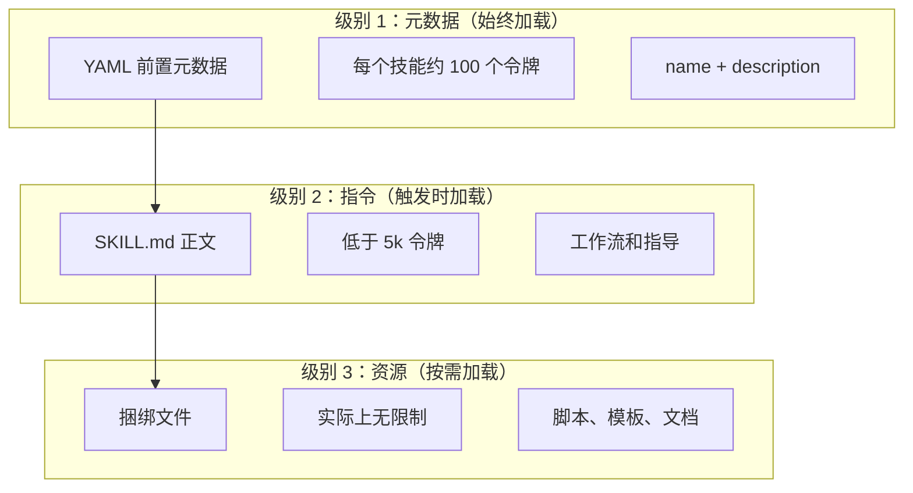
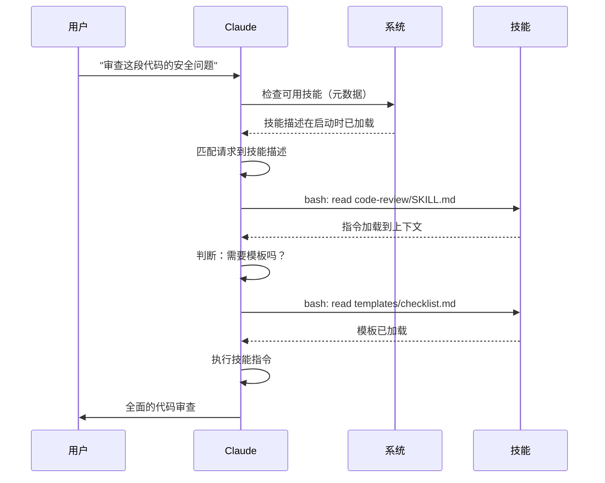

<picture>
  <source media="(prefers-color-scheme: dark)" srcset="../resources/logos/claude-howto-logo-dark.svg">
  
</picture>

# 代理技能（Agent Skill）指南

代理技能是基于文件系统的可复用能力，用于扩展 Claude 的功能。它们将特定领域的专业知识、工作流和最佳实践打包为可发现的组件，Claude 会在相关时自动使用。

## 概述

**代理技能**是将通用代理转变为专家的模块化能力。与提示词（Prompt）（对话级别的一次性任务指令）不同，技能按需加载，消除了在多个对话中反复提供相同指导的需要。

### 核心优势

- **让 Claude 专业化**：为特定领域的任务定制能力
- **减少重复**：创建一次，自动在多次对话中使用
- **组合能力**：结合技能构建复杂工作流
- **扩展工作流**：在多个项目和团队中复用技能
- **保持质量**：将最佳实践直接嵌入工作流

技能遵循 [Agent Skills](https://agentskills.io) 开放标准，该标准适用于多种 AI 工具。Claude Code 通过调用控制、子代理（Subagent）执行和动态上下文注入等额外功能扩展了该标准。

> **注意**：自定义斜杠命令（Slash Command）已合并到技能中。`.claude/commands/` 文件仍然有效，并支持相同的前置元数据（Frontmatter）字段。新开发推荐使用技能。当两者在同一路径下存在时（如 `.claude/commands/review.md` 和 `.claude/skills/review/SKILL.md`），技能优先。

## 技能工作原理：渐进式展示（Progressive Disclosure）

技能利用**渐进式展示**架构——Claude 按需分阶段加载信息，而非预先消耗上下文。这使得上下文管理高效的同时保持无限的可扩展性。

### 三个加载级别



| 级别 | 何时加载 | 令牌消耗 | 内容 |
|-------|------------|------------|---------|
| **级别 1：元数据** | 始终（启动时） | 每个技能约 100 令牌 | YAML 前置元数据中的 `name` 和 `description` |
| **级别 2：指令** | 技能被触发时 | 低于 5k 令牌 | SKILL.md 正文中的指令和指导 |
| **级别 3+：资源** | 按需 | 实际上无限制 | 通过 bash 执行的捆绑文件，不将内容加载到上下文中 |

这意味着你可以安装许多技能而无上下文惩罚——Claude 只知道每个技能的存在和使用时机，直到真正触发。

## 技能加载过程



## 技能类型与位置

| 类型 | 位置 | 范围 | 共享 | 最适合 |
|------|----------|-------|--------|----------|
| **企业** | 托管设置 | 所有组织用户 | 是 | 组织范围的标准 |
| **个人** | `~/.claude/skills/<skill-name>/SKILL.md` | 个人 | 否 | 个人工作流 |
| **项目** | `.claude/skills/<skill-name>/SKILL.md` | 团队 | 是（通过 git） | 团队标准 |
| **插件** | `<plugin>/skills/<skill-name>/SKILL.md` | 启用范围 | 取决于 | 与插件捆绑 |

当不同级别的技能同名时，更高优先级的位置获胜：**企业 > 个人 > 项目**。插件技能使用 `plugin-name:skill-name` 命名空间，因此不会冲突。

### 自动发现

**嵌套目录**：当你处理子目录中的文件时，Claude Code 自动从嵌套的 `.claude/skills/` 目录发现技能。例如，如果你正在编辑 `packages/frontend/` 中的文件，Claude Code 还会查找 `packages/frontend/.claude/skills/` 中的技能。这支持包含自己技能的单体仓库设置。

**`--add-dir` 目录**：通过 `--add-dir` 添加的目录中的技能会自动加载，并支持实时变更检测。对这些目录中技能文件的任何编辑会立即生效，无需重启 Claude Code。

**描述预算**：技能描述（级别 1 元数据）限制在上下文窗口的 **2%**（回退值：**16,000 字符**）。如果安装了太多技能，部分可能被排除。运行 `/context` 检查警告。可通过 `SLASH_COMMAND_TOOL_CHAR_BUDGET` 环境变量覆盖预算。

## 创建自定义技能

### 基本目录结构

```
my-skill/
├── SKILL.md           # 主要指令（必需）
├── template.md        # Claude 填写的模板
├── examples/
│   └── sample.md      # 展示预期格式的示例输出
└── scripts/
    └── validate.sh    # Claude 可以执行的脚本
```

### SKILL.md 格式

```yaml
---
name: your-skill-name
description: Brief description of what this Skill does and when to use it
---

# Your Skill Name

## Instructions
Provide clear, step-by-step guidance for Claude.

## Examples
Show concrete examples of using this Skill.
```

### 必填字段

- **name**：仅限小写字母、数字、连字符（最多 64 个字符）。不能包含 "anthropic" 或 "claude"。
- **description**：技能做什么以及何时使用（最多 1024 个字符）。这对 Claude 知道何时激活技能至关重要。

### 可选前置元数据字段

```yaml
---
name: my-skill
description: What this skill does and when to use it
argument-hint: "[filename] [format]"        # Hint for autocomplete
disable-model-invocation: true              # Only user can invoke
user-invocable: false                       # Hide from slash menu
allowed-tools: Read, Grep, Glob             # Restrict tool access
model: opus                                 # Specific model to use
effort: high                                # Effort level override (low, medium, high, max)
context: fork                               # Run in isolated subagent
agent: Explore                              # Which agent type (with context: fork)
shell: bash                                 # Shell for commands: bash (default) or powershell
hooks:                                      # Skill-scoped hooks
  PreToolUse:
    - matcher: "Bash"
      hooks:
        - type: command
          command: "./scripts/validate.sh"
---
```

| 字段 | 描述 |
|-------|-------------|
| `name` | 仅限小写字母、数字、连字符（最多 64 字符）。不能包含 "anthropic" 或 "claude"。 |
| `description` | 技能做什么以及何时使用（最多 1024 字符）。对自动调用匹配至关重要。 |
| `argument-hint` | 在 `/` 自动补全菜单中显示的提示（如 `"[filename] [format]"`）。 |
| `disable-model-invocation` | `true` = 仅用户可通过 `/name` 调用。Claude 永远不会自动调用。 |
| `user-invocable` | `false` = 从 `/` 菜单隐藏。仅 Claude 可以自动调用。 |
| `allowed-tools` | 技能可以无需权限提示使用的工具，逗号分隔列表。 |
| `model` | 技能活跃时的模型覆盖（如 `opus`、`sonnet`）。 |
| `effort` | 技能活跃时的努力级别覆盖：`low`、`medium`、`high` 或 `max`。 |
| `context` | `fork` 在分叉的子代理上下文中运行技能，拥有自己的上下文窗口。 |
| `agent` | `context: fork` 时的子代理类型（如 `Explore`、`Plan`、`general-purpose`）。 |
| `shell` | 用于 `!`command`` 替换和脚本的 shell：`bash`（默认）或 `powershell`。 |
| `hooks` | 限定在此技能生命周期内的钩子（与全局钩子格式相同）。 |

## 技能内容类型

技能可以包含两种类型的内容，各适用于不同目的：

### 参考内容

添加 Claude 应用于当前工作的知识——约定、模式、风格指南、领域知识。在你的对话上下文中内联运行。

```yaml
---
name: api-conventions
description: API design patterns for this codebase
---

When writing API endpoints:
- Use RESTful naming conventions
- Return consistent error formats
- Include request validation
```

### 任务内容

特定操作的分步指令。通常通过 `/skill-name` 直接调用。

```yaml
---
name: deploy
description: Deploy the application to production
context: fork
disable-model-invocation: true
---

Deploy the application:
1. Run the test suite
2. Build the application
3. Push to the deployment target
```

## 控制技能调用

默认情况下，你和 Claude 都可以调用任何技能。两个前置元数据字段控制三种调用模式：

| 前置元数据 | 你可以调用 | Claude 可以调用 |
|---|---|---|
| （默认） | 是 | 是 |
| `disable-model-invocation: true` | 是 | 否 |
| `user-invocable: false` | 否 | 是 |

**使用 `disable-model-invocation: true`** 用于有副作用的工作流：`/commit`、`/deploy`、`/send-slack-message`。你不希望 Claude 因为代码看起来准备好了就决定部署。

**使用 `user-invocable: false`** 用于不适合作为命令执行的背景知识。`legacy-system-context` 技能解释旧系统如何工作——对 Claude 有用，但对用户来说不是一个有意义的操作。

## 字符串替换

技能支持在技能内容到达 Claude 之前解析的动态值：

| 变量 | 描述 |
|----------|-------------|
| `$ARGUMENTS` | 调用技能时传递的所有参数 |
| `$ARGUMENTS[N]` 或 `$N` | 按索引访问特定参数（从 0 开始） |
| `${CLAUDE_SESSION_ID}` | 当前会话 ID |
| `${CLAUDE_SKILL_DIR}` | 包含技能 SKILL.md 文件的目录 |
| `` !`command` `` | 动态上下文注入——运行 shell 命令并内联输出 |

**示例：**

```yaml
---
name: fix-issue
description: Fix a GitHub issue
---

Fix GitHub issue $ARGUMENTS following our coding standards.
1. Read the issue description
2. Implement the fix
3. Write tests
4. Create a commit
```

运行 `/fix-issue 123` 将 `$ARGUMENTS` 替换为 `123`。

## 注入动态上下文

`!`command`` 语法在技能内容发送给 Claude 之前运行 shell 命令：

```yaml
---
name: pr-summary
description: Summarize changes in a pull request
context: fork
agent: Explore
---

## Pull request context
- PR diff: !`gh pr diff`
- PR comments: !`gh pr view --comments`
- Changed files: !`gh pr diff --name-only`

## Your task
Summarize this pull request...
```

命令立即执行；Claude 只看到最终输出。默认情况下，命令在 `bash` 中运行。在前置元数据中设置 `shell: powershell` 可使用 PowerShell。

## 在子代理中运行技能

添加 `context: fork` 以在隔离的子代理上下文中运行技能。技能内容成为专用子代理的任务，拥有自己的上下文窗口，保持主对话整洁。

`agent` 字段指定使用哪种代理类型：

| 代理类型 | 最适合 |
|---|---|
| `Explore` | 只读研究、代码库分析 |
| `Plan` | 创建实施计划 |
| `general-purpose` | 需要所有工具的广泛任务 |
| 自定义代理 | 在配置中定义的专门代理 |

**前置元数据示例：**

```yaml
---
context: fork
agent: Explore
---
```

**完整技能示例：**

```yaml
---
name: deep-research
description: Research a topic thoroughly
context: fork
agent: Explore
---

Research $ARGUMENTS thoroughly:
1. Find relevant files using Glob and Grep
2. Read and analyze the code
3. Summarize findings with specific file references
```

## 实际示例

### 示例 1：代码审查技能

**目录结构：**

```
~/.claude/skills/code-review/
├── SKILL.md
├── templates/
│   ├── review-checklist.md
│   └── finding-template.md
└── scripts/
    ├── analyze-metrics.py
    └── compare-complexity.py
```

**文件：** `~/.claude/skills/code-review/SKILL.md`

```yaml
---
name: code-review-specialist
description: Comprehensive code review with security, performance, and quality analysis. Use when users ask to review code, analyze code quality, evaluate pull requests, or mention code review, security analysis, or performance optimization.
---

# Code Review Skill

This skill provides comprehensive code review capabilities focusing on:

1. **Security Analysis**
   - Authentication/authorization issues
   - Data exposure risks
   - Injection vulnerabilities
   - Cryptographic weaknesses

2. **Performance Review**
   - Algorithm efficiency (Big O analysis)
   - Memory optimization
   - Database query optimization
   - Caching opportunities

3. **Code Quality**
   - SOLID principles
   - Design patterns
   - Naming conventions
   - Test coverage

4. **Maintainability**
   - Code readability
   - Function size (should be < 50 lines)
   - Cyclomatic complexity
   - Type safety

## Review Template

For each piece of code reviewed, provide:

### Summary
- Overall quality assessment (1-5)
- Key findings count
- Recommended priority areas

### Critical Issues (if any)
- **Issue**: Clear description
- **Location**: File and line number
- **Impact**: Why this matters
- **Severity**: Critical/High/Medium
- **Fix**: Code example

For detailed checklists, see [templates/review-checklist.md](templates/review-checklist.md).
```

### 示例 2：代码库可视化技能

一个生成交互式 HTML 可视化的技能：

**目录结构：**

```
~/.claude/skills/codebase-visualizer/
├── SKILL.md
└── scripts/
    └── visualize.py
```

**文件：** `~/.claude/skills/codebase-visualizer/SKILL.md`

```yaml
---
name: codebase-visualizer
description: Generate an interactive collapsible tree visualization of your codebase. Use when exploring a new repo, understanding project structure, or identifying large files.
allowed-tools: Bash(python *)
---

# Codebase Visualizer

Generate an interactive HTML tree view showing your project's file structure.

## Usage

Run the visualization script from your project root:

```bash
python ~/.claude/skills/codebase-visualizer/scripts/visualize.py .
```

This creates `codebase-map.html` and opens it in your default browser.

## What the visualization shows

- **Collapsible directories**: Click folders to expand/collapse
- **File sizes**: Displayed next to each file
- **Colors**: Different colors for different file types
- **Directory totals**: Shows aggregate size of each folder
```

捆绑的 Python 脚本完成繁重工作，而 Claude 负责编排。

### 示例 3：部署技能（仅用户调用）

```yaml
---
name: deploy
description: Deploy the application to production
disable-model-invocation: true
allowed-tools: Bash(npm *), Bash(git *)
---

Deploy $ARGUMENTS to production:

1. Run the test suite: `npm test`
2. Build the application: `npm run build`
3. Push to the deployment target
4. Verify the deployment succeeded
5. Report deployment status
```

### 示例 4：品牌语音技能（背景知识）

```yaml
---
name: brand-voice
description: Ensure all communication matches brand voice and tone guidelines. Use when creating marketing copy, customer communications, or public-facing content.
user-invocable: false
---

## Tone of Voice
- **Friendly but professional** - approachable without being casual
- **Clear and concise** - avoid jargon
- **Confident** - we know what we're doing
- **Empathetic** - understand user needs

## Writing Guidelines
- Use "you" when addressing readers
- Use active voice
- Keep sentences under 20 words
- Start with value proposition

For templates, see [templates/](templates/).
```

### 示例 5：CLAUDE.md 生成器技能

```yaml
---
name: claude-md
description: Create or update CLAUDE.md files following best practices for optimal AI agent onboarding. Use when users mention CLAUDE.md, project documentation, or AI onboarding.
---

## Core Principles

**LLMs are stateless**: CLAUDE.md is the only file automatically included in every conversation.

### The Golden Rules

1. **Less is More**: Keep under 300 lines (ideally under 100)
2. **Universal Applicability**: Only include information relevant to EVERY session
3. **Don't Use Claude as a Linter**: Use deterministic tools instead
4. **Never Auto-Generate**: Craft it manually with careful consideration

## Essential Sections

- **Project Name**: Brief one-line description
- **Tech Stack**: Primary language, frameworks, database
- **Development Commands**: Install, test, build commands
- **Critical Conventions**: Only non-obvious, high-impact conventions
- **Known Issues / Gotchas**: Things that trip up developers
```

### 示例 6：带脚本的重构技能

**目录结构：**

```
refactor/
├── SKILL.md
├── references/
│   ├── code-smells.md
│   └── refactoring-catalog.md
├── templates/
│   └── refactoring-plan.md
└── scripts/
    ├── analyze-complexity.py
    └── detect-smells.py
```

**文件：** `refactor/SKILL.md`

```yaml
---
name: code-refactor
description: Systematic code refactoring based on Martin Fowler's methodology. Use when users ask to refactor code, improve code structure, reduce technical debt, or eliminate code smells.
---

# Code Refactoring Skill

A phased approach emphasizing safe, incremental changes backed by tests.

## Workflow

Phase 1: Research & Analysis → Phase 2: Test Coverage Assessment →
Phase 3: Code Smell Identification → Phase 4: Refactoring Plan Creation →
Phase 5: Incremental Implementation → Phase 6: Review & Iteration

## Core Principles

1. **Behavior Preservation**: External behavior must remain unchanged
2. **Small Steps**: Make tiny, testable changes
3. **Test-Driven**: Tests are the safety net
4. **Continuous**: Refactoring is ongoing, not a one-time event

For code smell catalog, see [references/code-smells.md](references/code-smells.md).
For refactoring techniques, see [references/refactoring-catalog.md](references/refactoring-catalog.md).
```

## 支持文件

技能可以在其目录中包含 `SKILL.md` 之外的多个文件。这些支持文件（模板、示例、脚本、参考文档）让你保持主技能文件的专注，同时为 Claude 提供按需加载的额外资源。

```
my-skill/
├── SKILL.md              # 主要指令（必需，保持在 500 行以内）
├── templates/            # Claude 填写的模板
│   └── output-format.md
├── examples/             # 展示预期格式的示例输出
│   └── sample-output.md
├── references/           # 领域知识和规范
│   └── api-spec.md
└── scripts/              # Claude 可以执行的脚本
    └── validate.sh
```

支持文件的准则：

- 保持 `SKILL.md` 在 **500 行**以内。将详细的参考材料、大型示例和规范移至单独的文件。
- 从 `SKILL.md` 中使用**相对路径**引用额外文件（如 `[API reference](references/api-spec.md)`）。
- 支持文件在级别 3（按需）加载，因此在 Claude 实际读取之前不会消耗上下文。

## 管理技能

### 查看可用技能

直接询问 Claude：
```
有哪些可用的技能？
```

或检查文件系统：
```bash
# 列出个人技能
ls ~/.claude/skills/

# 列出项目技能
ls .claude/skills/
```

### 测试技能

两种测试方式：

**让 Claude 自动调用**，通过提出与描述匹配的请求：
```
你能帮我审查这段代码的安全问题吗？
```

**或直接调用**，使用技能名称：
```
/code-review src/auth/login.ts
```

### 更新技能

直接编辑 `SKILL.md` 文件。变更在下次 Claude Code 启动时生效。

```bash
# 个人技能
code ~/.claude/skills/my-skill/SKILL.md

# 项目技能
code .claude/skills/my-skill/SKILL.md
```

### 限制 Claude 的技能访问

三种控制 Claude 可以调用哪些技能的方式：

**在 `/permissions` 中禁用所有技能**：
```
# Add to deny rules:
Skill
```

**允许或拒绝特定技能**：
```
# Allow only specific skills
Skill(commit)
Skill(review-pr *)

# Deny specific skills
Skill(deploy *)
```

**隐藏单个技能**，在其前置元数据中添加 `disable-model-invocation: true`。

## 最佳实践

### 1. 使描述具体

- **不好（模糊）**："帮助处理文档"
- **好（具体）**："从 PDF 文件中提取文本和表格，填写表单，合并文档。在处理 PDF 文件或用户提到 PDF、表单或文档提取时使用。"

### 2. 保持技能聚焦

- 一个技能 = 一项能力
- 好："PDF 表单填写"
- 不好："文档处理"（太宽泛）

### 3. 包含触发词

在描述中添加匹配用户请求的关键词：
```yaml
description: Analyze Excel spreadsheets, generate pivot tables, create charts. Use when working with Excel files, spreadsheets, or .xlsx files.
```

### 4. 保持 SKILL.md 在 500 行以内

将详细的参考材料移至 Claude 按需加载的单独文件。

### 5. 引用支持文件

```markdown
## Additional resources

- For complete API details, see [reference.md](reference.md)
- For usage examples, see [examples.md](examples.md)
```

### 推荐做法

- 使用清晰、描述性的名称
- 包含全面的指令
- 添加具体示例
- 打包相关的脚本和模板
- 使用真实场景测试
- 记录依赖项

### 避免做法

- 不要为一次性任务创建技能
- 不要复制现有功能
- 不要使技能过于宽泛
- 不要跳过 description 字段
- 不要在未审计的情况下安装来自不受信任来源的技能

## 故障排查

### 快速参考

| 问题 | 解决方案 |
|-------|----------|
| Claude 不使用技能 | 使描述更具体，包含触发词 |
| 找不到技能文件 | 验证路径：`~/.claude/skills/name/SKILL.md` |
| YAML 错误 | 检查 `---` 标记、缩进、无 tab |
| 技能冲突 | 在描述中使用不同的触发词 |
| 脚本不运行 | 检查权限：`chmod +x scripts/*.py` |
| Claude 看不到所有技能 | 技能太多；检查 `/context` 的警告 |

### 技能未触发

如果 Claude 在预期时没有使用你的技能：

1. 检查描述是否包含用户自然会说的关键词
2. 验证技能在询问"有哪些可用技能？"时出现
3. 尝试重新表述请求以匹配描述
4. 直接使用 `/skill-name` 调用来测试

### 技能触发过于频繁

如果 Claude 在你不想要的时候使用了技能：

1. 使描述更具体
2. 添加 `disable-model-invocation: true` 以仅允许手动调用

### Claude 看不到所有技能

技能描述加载限制在上下文窗口的 **2%**（回退值：**16,000 字符**）。运行 `/context` 检查关于被排除技能的警告。可通过 `SLASH_COMMAND_TOOL_CHAR_BUDGET` 环境变量覆盖预算。

## 安全考虑

**仅使用来自受信任来源的技能。** 技能通过指令和代码为 Claude 提供能力——恶意技能可以指导 Claude 以有害方式调用工具或执行代码。

**关键安全考虑：**

- **彻底审计**：审查技能目录中的所有文件
- **外部来源有风险**：从外部 URL 获取的技能可能被入侵
- **工具滥用**：恶意技能可以以有害方式调用工具
- **视同安装软件**：仅使用来自受信任来源的技能

## 技能与其他功能的比较

| 功能 | 调用方式 | 最适合 |
|---------|------------|----------|
| **技能** | 自动或 `/name` | 可复用的专业知识、工作流 |
| **斜杠命令** | 用户发起的 `/name` | 快速捷径（已合并到技能中） |
| **子代理** | 自动委托 | 隔离的任务执行 |
| **记忆 (CLAUDE.md)** | 始终加载 | 持久化项目上下文 |
| **MCP** | 实时 | 外部数据/服务访问 |
| **钩子** | 事件驱动 | 自动化副作用 |

## 捆绑技能

Claude Code 附带几个内置技能，无需安装即可使用：

| 技能 | 描述 |
|-------|-------------|
| `/simplify` | 审查已变更文件的复用性、质量和效率；生成 3 个并行审查代理 |
| `/batch <instruction>` | 使用 git 工作树在代码库中编排大规模并行变更 |
| `/debug [description]` | 通过读取调试日志排查当前会话问题 |
| `/loop [interval] <prompt>` | 按间隔重复运行提示词（如 `/loop 5m check the deploy`） |
| `/claude-api` | 加载 Claude API/SDK 参考；在 `anthropic`/`@anthropic-ai/sdk` 导入时自动激活 |

这些技能开箱即用，无需安装或配置。它们遵循与自定义技能相同的 SKILL.md 格式。

## 共享技能

### 项目技能（团队共享）

1. 在 `.claude/skills/` 中创建技能
2. 提交到 git
3. 团队成员拉取变更——技能立即可用

### 个人技能

```bash
# 复制到个人目录
cp -r my-skill ~/.claude/skills/

# 使脚本可执行
chmod +x ~/.claude/skills/my-skill/scripts/*.py
```

### 插件分发

将技能打包在插件的 `skills/` 目录中以进行更广泛的分发。

## 进一步了解：技能集合和技能管理器

一旦你开始认真构建技能，两件事变得至关重要：一个经过验证的技能库和一个管理它们的工具。

**[luongnv89/skills](https://github.com/luongnv89/skills)** —— 我在几乎所有项目中日常使用的技能集合。亮点包括 `logo-designer`（即时生成项目 logo）和 `ollama-optimizer`（为你的硬件调优本地 LLM 性能）。如果你想要开箱即用的技能，这是一个很好的起点。

**[luongnv89/asm](https://github.com/luongnv89/asm)** —— 代理技能管理器。处理技能开发、重复检测和测试。`asm link` 命令让你可以在任何项目中测试技能而无需复制文件——当你有多个技能时这是必不可少的。

## 其他资源

- [官方技能文档](https://code.claude.com/docs/en/skills)
- [代理技能架构博客](https://claude.com/blog/equipping-agents-for-the-real-world-with-agent-skills)
- [技能仓库](https://github.com/luongnv89/skills) - 即用型技能集合
- [斜杠命令指南](../01-slash-commands/) - 用户发起的快捷方式
- [子代理指南](../04-subagents/) - 委托 AI 代理
- [记忆指南](../02-memory/) - 持久化上下文
- [MCP（模型上下文协议）](../05-mcp/) - 实时外部数据
- [钩子指南](../06-hooks/) - 事件驱动自动化
