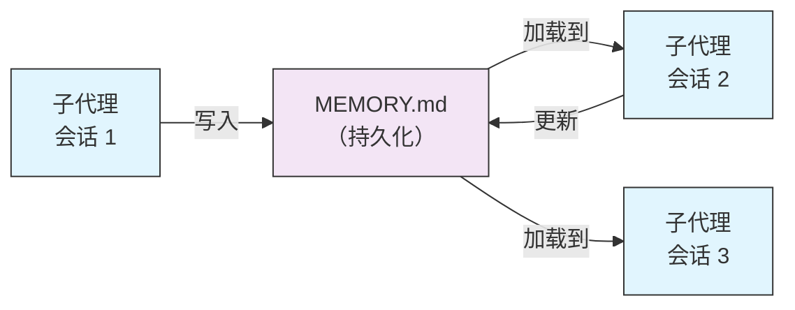
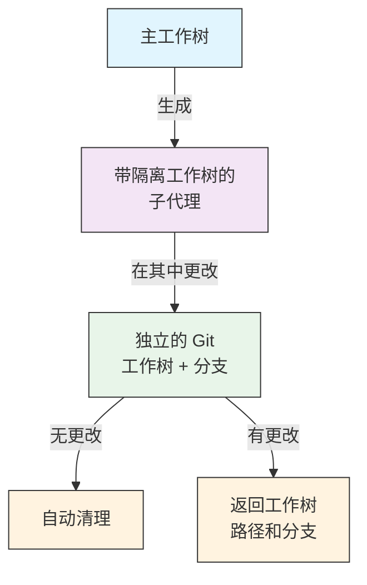
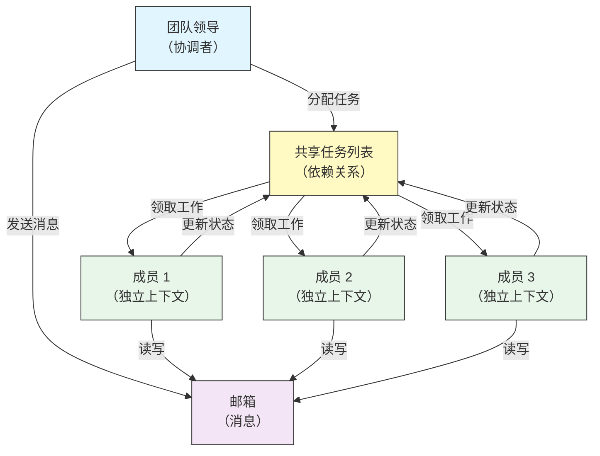
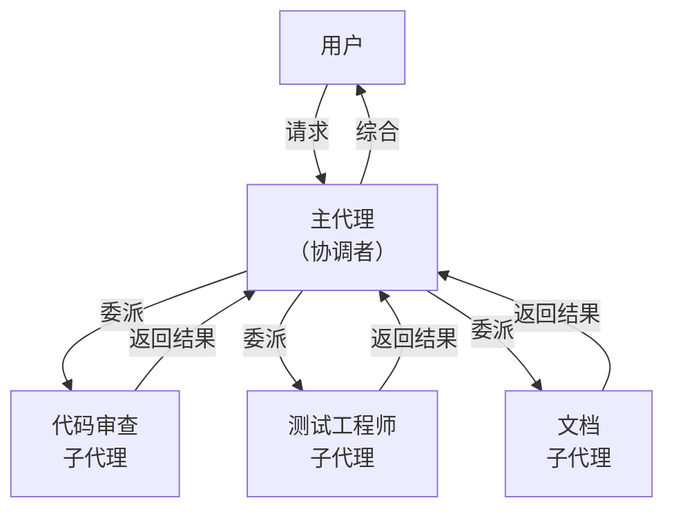
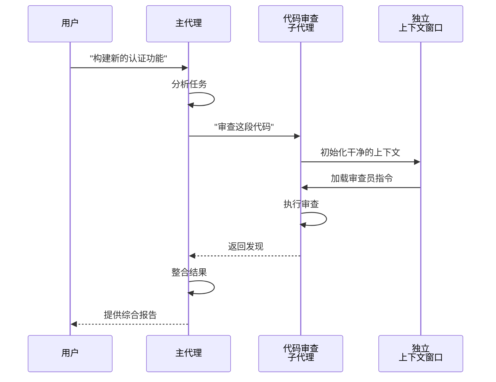
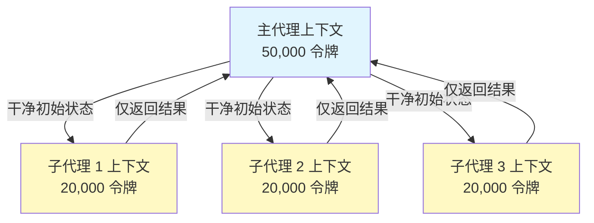
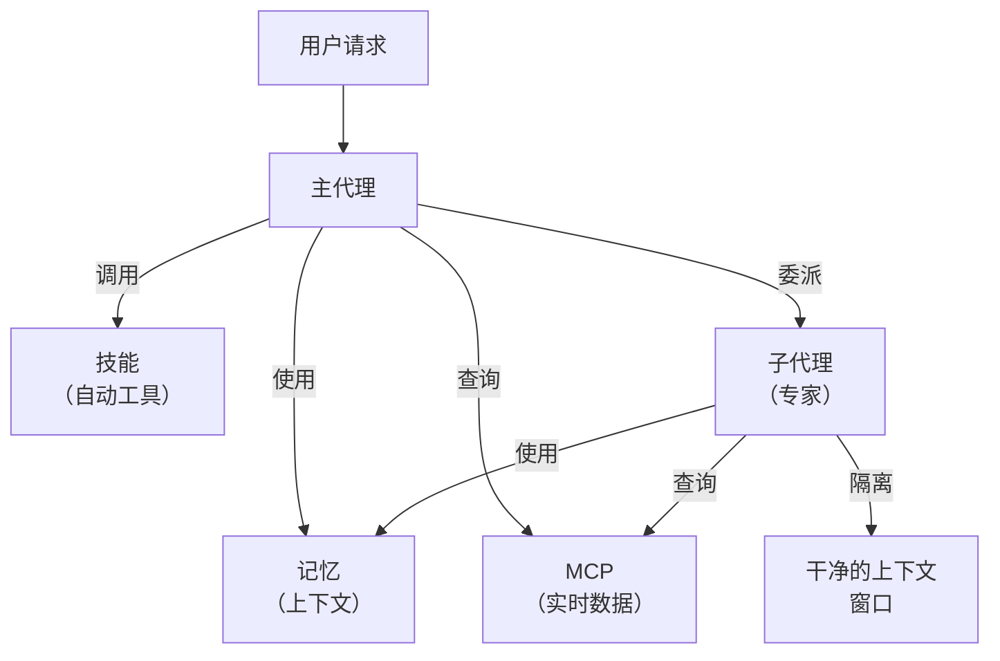

<picture>
  <source media="(prefers-color-scheme: dark)" srcset="../resources/logos/claude-howto-logo-dark.svg">
  
</picture>

# 子代理 — 完整参考指南

子代理（Subagent）是 Claude Code 可以委派任务的专业 AI 助手。每个子代理都有特定的用途，使用独立于主对话的上下文窗口（Context Window），并且可以配置特定的工具和自定义系统提示词（Prompt）。

## 目录

1. [概述](#概述)
2. [核心优势](#核心优势)
3. [文件位置](#文件位置)
4. [配置](#配置)
5. [内置子代理](#内置子代理)
6. [管理子代理](#管理子代理)
7. [使用子代理](#使用子代理)
8. [可恢复代理](#可恢复代理)
9. [链式子代理](#链式子代理)
10. [子代理的持久记忆](#子代理的持久记忆)
11. [后台子代理](#后台子代理)
12. [工作树隔离](#工作树隔离)
13. [限制可生成的子代理](#限制可生成的子代理)
14. [`claude agents` CLI 命令](#claude-agents-cli-命令)
15. [代理团队（实验性）](#代理团队实验性)
16. [插件子代理安全](#插件子代理安全)
17. [架构](#架构)
18. [上下文管理](#上下文管理)
19. [何时使用子代理](#何时使用子代理)
20. [最佳实践](#最佳实践)
21. [本文件夹中的示例子代理](#本文件夹中的示例子代理)
22. [安装说明](#安装说明)
23. [相关概念](#相关概念)

---

## 概述

子代理通过以下方式实现 Claude Code 中的委派任务执行：

- 创建具有独立上下文窗口的**隔离 AI 助手**
- 提供**自定义系统提示词**以获得专业领域能力
- 执行**工具访问控制**来限制功能范围
- 防止复杂任务导致的**上下文污染**
- 支持多个专业任务的**并行执行**

每个子代理独立运行，拥有干净的初始状态，仅接收其任务所需的特定上下文，然后将结果返回给主代理进行综合。

**快速开始**：使用 `/agents` 命令交互式地创建、查看、编辑和管理你的子代理。

---

## 核心优势

| 优势 | 描述 |
|------|------|
| **上下文保护** | 在独立上下文中运行，防止主对话被污染 |
| **专业能力** | 针对特定领域进行微调，成功率更高 |
| **可复用性** | 可在不同项目中使用，并与团队共享 |
| **灵活权限** | 不同类型的子代理有不同的工具访问级别 |
| **可扩展性** | 多个代理可以同时处理不同方面的工作 |

---

## 文件位置

子代理文件可以存储在多个位置，具有不同的作用域：

| 优先级 | 类型 | 位置 | 作用域 |
|--------|------|------|--------|
| 1（最高） | **CLI 定义** | 通过 `--agents` 标志（JSON） | 仅当前会话 |
| 2 | **项目子代理** | `.claude/agents/` | 当前项目 |
| 3 | **用户子代理** | `~/.claude/agents/` | 所有项目 |
| 4（最低） | **插件代理** | 插件（Plugin）的 `agents/` 目录 | 通过插件 |

当存在重名时，优先级更高的来源优先生效。

---

## 配置

### 文件格式

子代理在 YAML 前置元数据（Frontmatter）中定义，后跟 markdown 格式的系统提示词：

```yaml
---
name: your-sub-agent-name
description: Description of when this subagent should be invoked
tools: tool1, tool2, tool3  # Optional - inherits all tools if omitted
disallowedTools: tool4  # Optional - explicitly disallowed tools
model: sonnet  # Optional - sonnet, opus, haiku, or inherit
permissionMode: default  # Optional - permission mode
maxTurns: 20  # Optional - limit agentic turns
skills: skill1, skill2  # Optional - skills to preload into context
mcpServers: server1  # Optional - MCP servers to make available
memory: user  # Optional - persistent memory scope (user, project, local)
background: false  # Optional - run as background task
effort: high  # Optional - reasoning effort (low, medium, high, max)
isolation: worktree  # Optional - git worktree isolation
initialPrompt: "Start by analyzing the codebase"  # Optional - auto-submitted first turn
hooks:  # Optional - component-scoped hooks
  PreToolUse:
    - matcher: "Bash"
      hooks:
        - type: command
          command: "./scripts/security-check.sh"
---

Your subagent's system prompt goes here. This can be multiple paragraphs
and should clearly define the subagent's role, capabilities, and approach
to solving problems.
```

### 配置字段

| 字段 | 必填 | 描述 |
|------|------|------|
| `name` | 是 | 唯一标识符（小写字母和连字符） |
| `description` | 是 | 用途的自然语言描述。包含 "use PROACTIVELY" 可鼓励自动调用 |
| `tools` | 否 | 逗号分隔的特定工具列表。省略则继承所有工具。支持 `Agent(agent_name)` 语法来限制可生成的子代理 |
| `disallowedTools` | 否 | 逗号分隔的子代理禁止使用的工具列表 |
| `model` | 否 | 使用的模型：`sonnet`、`opus`、`haiku`、完整模型 ID 或 `inherit`。默认为配置的子代理模型 |
| `permissionMode` | 否 | `default`、`acceptEdits`、`dontAsk`、`bypassPermissions`、`plan` |
| `maxTurns` | 否 | 子代理可执行的最大代理轮次数 |
| `skills` | 否 | 逗号分隔的预加载技能（Skill）列表。在启动时将完整的技能内容注入子代理的上下文 |
| `mcpServers` | 否 | 可供子代理使用的模型上下文协议（MCP）服务器 |
| `hooks` | 否 | 组件级钩子（Hook）（PreToolUse、PostToolUse、Stop） |
| `memory` | 否 | 持久记忆（Memory）目录作用域：`user`、`project` 或 `local` |
| `background` | 否 | 设为 `true` 则始终将此子代理作为后台任务运行 |
| `effort` | 否 | 推理努力级别：`low`、`medium`、`high` 或 `max` |
| `isolation` | 否 | 设为 `worktree` 为子代理提供独立的 git 工作树（Worktree） |
| `initialPrompt` | 否 | 子代理作为主代理运行时自动提交的首轮提示词 |

### 工具配置选项

**选项 1：继承所有工具（省略该字段）**
```yaml
---
name: full-access-agent
description: Agent with all available tools
---
```

**选项 2：指定单独的工具**
```yaml
---
name: limited-agent
description: Agent with specific tools only
tools: Read, Grep, Glob, Bash
---
```

**选项 3：条件工具访问**
```yaml
---
name: conditional-agent
description: Agent with filtered tool access
tools: Read, Bash(npm:*), Bash(test:*)
---
```

### 基于 CLI 的配置

使用 `--agents` 标志以 JSON 格式为单个会话定义子代理：

```bash
claude --agents '{
  "code-reviewer": {
    "description": "Expert code reviewer. Use proactively after code changes.",
    "prompt": "You are a senior code reviewer. Focus on code quality, security, and best practices.",
    "tools": ["Read", "Grep", "Glob", "Bash"],
    "model": "sonnet"
  }
}'
```

**`--agents` 标志的 JSON 格式：**

```json
{
  "agent-name": {
    "description": "Required: when to invoke this agent",
    "prompt": "Required: system prompt for the agent",
    "tools": ["Optional", "array", "of", "tools"],
    "model": "optional: sonnet|opus|haiku"
  }
}
```

**代理定义的优先级：**

代理定义按以下优先级加载（首次匹配生效）：
1. **CLI 定义** — `--agents` 标志（仅当前会话，JSON）
2. **项目级** — `.claude/agents/`（当前项目）
3. **用户级** — `~/.claude/agents/`（所有项目）
4. **插件级** — 插件的 `agents/` 目录

这允许 CLI 定义在单个会话中覆盖所有其他来源。

---

## 内置子代理

Claude Code 包含多个始终可用的内置子代理：

| 代理 | 模型 | 用途 |
|------|------|------|
| **general-purpose** | 继承 | 复杂的多步骤任务 |
| **Plan** | 继承 | 计划模式下的研究 |
| **Explore** | Haiku | 只读的代码库探索（快速/中等/非常彻底） |
| **Bash** | 继承 | 在独立上下文中执行终端命令 |
| **statusline-setup** | Sonnet | 配置状态行 |
| **Claude Code Guide** | Haiku | 回答 Claude Code 功能问题 |

### 通用子代理

| 属性 | 值 |
|------|-----|
| **模型** | 继承自父代理 |
| **工具** | 所有工具 |
| **用途** | 复杂研究任务、多步骤操作、代码修改 |

**使用场景**：需要探索和修改兼备的复杂推理任务。

### 计划子代理

| 属性 | 值 |
|------|-----|
| **模型** | 继承自父代理 |
| **工具** | Read、Glob、Grep、Bash |
| **用途** | 在计划模式下自动用于研究代码库 |

**使用场景**：Claude 需要在提出计划之前理解代码库时。

### 探索子代理

| 属性 | 值 |
|------|-----|
| **模型** | Haiku（快速、低延迟） |
| **模式** | 严格只读 |
| **工具** | Glob、Grep、Read、Bash（仅只读命令） |
| **用途** | 快速的代码库搜索和分析 |

**使用场景**：搜索/理解代码而不做更改时。

**彻底程度** — 指定探索深度：
- **"quick"** — 快速搜索，最小探索范围，适合查找特定模式
- **"medium"** — 适度探索，速度和彻底程度均衡，默认方式
- **"very thorough"** — 跨多个位置和命名约定的全面分析，可能耗时较长

### Bash 子代理

| 属性 | 值 |
|------|-----|
| **模型** | 继承自父代理 |
| **工具** | Bash |
| **用途** | 在独立的上下文窗口中执行终端命令 |

**使用场景**：运行受益于隔离上下文的 shell 命令时。

### 状态行设置子代理

| 属性 | 值 |
|------|-----|
| **模型** | Sonnet |
| **工具** | Read、Write、Bash |
| **用途** | 配置 Claude Code 状态行显示 |

**使用场景**：设置或自定义状态行时。

### Claude Code 指南子代理

| 属性 | 值 |
|------|-----|
| **模型** | Haiku（快速、低延迟） |
| **工具** | 只读 |
| **用途** | 回答关于 Claude Code 功能和用法的问题 |

**使用场景**：用户询问 Claude Code 如何工作或如何使用特定功能时。

---

## 管理子代理

### 使用 `/agents` 命令（推荐）

```bash
/agents
```

该命令提供交互式菜单，可以：
- 查看所有可用的子代理（内置、用户和项目级别）
- 通过引导设置创建新子代理
- 编辑现有的自定义子代理和工具访问
- 删除自定义子代理
- 查看存在重名时哪些子代理处于激活状态

### 直接文件管理

```bash
# 创建项目子代理
mkdir -p .claude/agents
cat > .claude/agents/test-runner.md << 'EOF'
---
name: test-runner
description: Use proactively to run tests and fix failures
---

You are a test automation expert. When you see code changes, proactively
run the appropriate tests. If tests fail, analyze the failures and fix
them while preserving the original test intent.
EOF

# 创建用户子代理（在所有项目中可用）
mkdir -p ~/.claude/agents
```

---

## 使用子代理

### 自动委派

Claude 基于以下因素主动委派任务：
- 请求中的任务描述
- 子代理配置中的 `description` 字段
- 当前上下文和可用工具

要鼓励主动使用，在 `description` 字段中包含 "use PROACTIVELY" 或 "MUST BE USED"：

```yaml
---
name: code-reviewer
description: Expert code review specialist. Use PROACTIVELY after writing or modifying code.
---
```

### 显式调用

你可以显式请求特定的子代理：

```
> Use the test-runner subagent to fix failing tests
> Have the code-reviewer subagent look at my recent changes
> Ask the debugger subagent to investigate this error
```

### @-提及调用

使用 `@` 前缀来确保调用特定的子代理（绕过自动委派的启发式规则）：

```
> @"code-reviewer (agent)" review the auth module
```

### 全会话代理

使用特定代理作为主代理运行整个会话：

```bash
# 通过 CLI 标志
claude --agent code-reviewer

# 通过 settings.json
{
  "agent": "code-reviewer"
}
```

### 列出可用代理

使用 `claude agents` 命令列出来自所有来源的已配置代理：

```bash
claude agents
```

---

## 可恢复代理

子代理可以继续之前的对话，完整保留上下文：

```bash
# 初始调用
> Use the code-analyzer agent to start reviewing the authentication module
# 返回 agentId: "abc123"

# 稍后恢复代理
> Resume agent abc123 and now analyze the authorization logic as well
```

**使用场景**：
- 跨多个会话的长期研究
- 不丢失上下文的迭代优化
- 保持上下文的多步骤工作流

---

## 链式子代理

按顺序执行多个子代理：

```bash
> First use the code-analyzer subagent to find performance issues,
  then use the optimizer subagent to fix them
```

这使得复杂工作流成为可能，其中一个子代理的输出作为另一个的输入。

---

## 子代理的持久记忆

`memory` 字段为子代理提供跨对话持久化的目录。这允许子代理随时间积累知识，存储跨会话持久化的笔记、发现和上下文。

### 记忆作用域

| 作用域 | 目录 | 使用场景 |
|--------|------|----------|
| `user` | `~/.claude/agent-memory/<name>/` | 跨所有项目的个人笔记和偏好 |
| `project` | `.claude/agent-memory/<name>/` | 与团队共享的项目特定知识 |
| `local` | `.claude/agent-memory-local/<name>/` | 不提交到版本控制的本地项目知识 |

### 工作原理

- 记忆目录中 `MEMORY.md` 的前 200 行会自动加载到子代理的系统提示词中
- `Read`、`Write` 和 `Edit` 工具会自动启用，供子代理管理其记忆文件
- 子代理可以根据需要在其记忆目录中创建额外的文件

### 配置示例

```yaml
---
name: researcher
memory: user
---

You are a research assistant. Use your memory directory to store findings,
track progress across sessions, and build up knowledge over time.

Check your MEMORY.md file at the start of each session to recall previous context.
```



---

## 后台子代理

子代理可以在后台运行，释放主对话来处理其他任务。

### 配置

在前置元数据中设置 `background: true` 以始终将子代理作为后台任务运行：

```yaml
---
name: long-runner
background: true
description: Performs long-running analysis tasks in the background
---
```

### 键盘快捷键

| 快捷键 | 操作 |
|--------|------|
| `Ctrl+B` | 将当前运行的子代理任务转入后台 |
| `Ctrl+F` | 终止所有后台代理（按两次确认） |

### 禁用后台任务

设置环境变量以完全禁用后台任务支持：

```bash
export CLAUDE_CODE_DISABLE_BACKGROUND_TASKS=1
```

---

## 工作树隔离

`isolation: worktree` 设置为子代理提供独立的 git 工作树，允许其独立进行更改而不影响主工作树。

### 配置

```yaml
---
name: feature-builder
isolation: worktree
description: Implements features in an isolated git worktree
tools: Read, Write, Edit, Bash, Grep, Glob
---
```

### 工作原理



- 子代理在独立的 git 工作树和单独的分支上运行
- 如果子代理未做任何更改，工作树会自动清理
- 如果存在更改，工作树路径和分支名称会返回给主代理，供审查或合并

---

## 限制可生成的子代理

你可以通过在 `tools` 字段中使用 `Agent(agent_type)` 语法来控制子代理可以生成哪些子代理。这提供了一种白名单机制来限定委派范围。

> **注意**：在 v2.1.63 中，`Task` 工具被重命名为 `Agent`。现有的 `Task(...)` 引用仍然作为别名有效。

### 示例

```yaml
---
name: coordinator
description: Coordinates work between specialized agents
tools: Agent(worker, researcher), Read, Bash
---

You are a coordinator agent. You can delegate work to the "worker" and
"researcher" subagents only. Use Read and Bash for your own exploration.
```

在此示例中，`coordinator` 子代理只能生成 `worker` 和 `researcher` 子代理。即使其他子代理已在别处定义，它也无法生成。

---

## `claude agents` CLI 命令

`claude agents` 命令列出按来源分组的所有已配置代理（内置、用户级、项目级）：

```bash
claude agents
```

该命令：
- 显示来自所有来源的可用代理
- 按来源位置分组代理
- 当高优先级级别的代理遮蔽低优先级级别的同名代理时，显示**覆盖**标记（例如，与用户级代理同名的项目级代理）

---

## 代理团队（实验性）

代理团队协调多个 Claude Code 实例协同处理复杂任务。与子代理（被委派子任务后返回结果）不同，团队成员独立工作，拥有各自的上下文，并通过共享邮箱系统直接通信。

> **注意**：代理团队为实验性功能，需要 Claude Code v2.1.32+。使用前需先启用。

### 子代理 vs 代理团队

| 方面 | 子代理 | 代理团队 |
|------|--------|----------|
| **委派模型** | 父代理委派子任务，等待结果 | 团队领导分配工作，成员独立执行 |
| **上下文** | 每个子任务使用全新上下文，结果提炼后返回 | 每个成员维护自己的持久上下文 |
| **协调** | 顺序或并行，由父代理管理 | 共享任务列表，自动依赖管理 |
| **通信** | 仅返回值 | 通过邮箱进行代理间通信 |
| **会话恢复** | 支持 | 进程内成员不支持 |
| **适用场景** | 专注、定义明确的子任务 | 需要并行工作的大型多文件项目 |

### 启用代理团队

设置环境变量或添加到 `settings.json`：

```bash
export CLAUDE_CODE_EXPERIMENTAL_AGENT_TEAMS=1
```

或在 `settings.json` 中：

```json
{
  "env": {
    "CLAUDE_CODE_EXPERIMENTAL_AGENT_TEAMS": "1"
  }
}
```

### 启动团队

启用后，在提示词中要求 Claude 与团队成员协作：

```
User: Build the authentication module. Use a team — one teammate for the API endpoints,
      one for the database schema, and one for the test suite.
```

Claude 会自动创建团队、分配任务并协调工作。

### 显示模式

控制团队成员活动的显示方式：

| 模式 | 标志 | 描述 |
|------|------|------|
| **自动** | `--teammate-mode auto` | 自动为你的终端选择最佳显示模式 |
| **进程内** | `--teammate-mode in-process` | 在当前终端内联显示成员输出（默认） |
| **分屏** | `--teammate-mode tmux` | 在单独的 tmux 或 iTerm2 面板中打开每个成员 |

```bash
claude --teammate-mode tmux
```

你也可以在 `settings.json` 中设置显示模式：

```json
{
  "teammateMode": "tmux"
}
```

> **注意**：分屏模式需要 tmux 或 iTerm2。在 VS Code 终端、Windows Terminal 或 Ghostty 中不可用。

### 导航

在分屏模式下使用 `Shift+Down` 在团队成员之间导航。

### 团队配置

团队配置存储在 `~/.claude/teams/{team-name}/config.json`。

### 架构



**关键组件**：

- **团队领导**：创建团队、分配任务并协调的主 Claude Code 会话
- **共享任务列表**：带有自动依赖跟踪的同步任务列表
- **邮箱**：供团队成员通信状态和协调的代理间通信系统
- **成员**：独立的 Claude Code 实例，各自拥有独立的上下文窗口

### 任务分配和通信

团队领导将工作拆分为任务并分配给成员。共享任务列表处理：

- **自动依赖管理** — 任务等待其依赖完成
- **状态跟踪** — 成员在工作时更新任务状态
- **代理间通信** — 成员通过邮箱发送消息进行协调（例如，"数据库 schema 已就绪，你可以开始编写查询了"）

### 计划审批工作流

对于复杂任务，团队领导在成员开始工作之前创建执行计划。用户审查并批准该计划，确保团队的方案在进行任何代码更改之前符合预期。

### 团队的钩子事件

代理团队引入了两个额外的[钩子事件](../06-hooks/)：

| 事件 | 触发时机 | 使用场景 |
|------|----------|----------|
| `TeammateIdle` | 成员完成当前任务且没有待处理工作时 | 触发通知、分配后续任务 |
| `TaskCompleted` | 共享任务列表中的任务被标记为完成时 | 运行验证、更新仪表板、链接依赖工作 |

### 最佳实践

- **团队规模**：保持 3-5 名成员以获得最佳协调效果
- **任务大小**：将工作拆分为每个 5-15 分钟的任务 — 足够小以便并行化，足够大以便有意义
- **避免文件冲突**：将不同的文件或目录分配给不同的成员，防止合并冲突
- **从简单开始**：首次使用团队时使用进程内模式；熟悉后再切换到分屏
- **清晰的任务描述**：提供具体、可操作的任务描述，以便成员独立工作

### 限制

- **实验性**：功能行为可能在未来版本中变化
- **不支持会话恢复**：进程内成员在会话结束后无法恢复
- **每个会话一个团队**：无法在单个会话中创建嵌套团队或多个团队
- **固定领导**：团队领导角色无法转移给成员
- **分屏限制**：需要 tmux/iTerm2；在 VS Code 终端、Windows Terminal 或 Ghostty 中不可用
- **不支持跨会话团队**：成员仅存在于当前会话中

> **警告**：代理团队为实验性功能。请先用非关键工作进行测试，并监控成员协调是否有异常行为。

---

## 插件子代理安全

插件提供的子代理出于安全考虑，其前置元数据功能受到限制。以下字段在插件子代理定义中**不允许使用**：

- `hooks` — 不能定义生命周期钩子
- `mcpServers` — 不能配置 MCP 服务器
- `permissionMode` — 不能覆盖权限模式（Permission Mode）设置

这防止了插件通过子代理钩子提升权限或执行任意命令。

---

## 架构

### 高层架构



### 子代理生命周期



---

## 上下文管理



### 要点

- 每个子代理获得一个**全新的上下文窗口**，不含主对话历史
- 仅将**相关上下文**传递给子代理用于其特定任务
- 结果经过**提炼**后返回主代理
- 这防止了长期项目中的**上下文令牌（Token）耗尽**

### 性能考量

- **上下文效率** — 代理保护主上下文，支持更长的会话
- **延迟** — 子代理从干净状态启动，收集初始上下文可能增加延迟

### 关键行为

- **不支持嵌套生成** — 子代理不能生成其他子代理
- **后台权限** — 后台子代理自动拒绝任何未预先批准的权限
- **后台化** — 按 `Ctrl+B` 将当前运行的任务转入后台
- **会话记录** — 子代理的会话记录存储在 `~/.claude/projects/{project}/{sessionId}/subagents/agent-{agentId}.jsonl`
- **自动压缩** — 子代理上下文在约 95% 容量时自动压缩（可通过 `CLAUDE_AUTOCOMPACT_PCT_OVERRIDE` 环境变量覆盖）

---

## 何时使用子代理

| 场景 | 使用子代理 | 原因 |
|------|------------|------|
| 多步骤的复杂功能 | 是 | 分离关注点，防止上下文污染 |
| 快速代码审查 | 否 | 不必要的开销 |
| 并行任务执行 | 是 | 每个子代理有独立上下文 |
| 需要专业能力 | 是 | 自定义系统提示词 |
| 长时间运行的分析 | 是 | 防止主上下文耗尽 |
| 单个任务 | 否 | 不必要地增加延迟 |

---

## 最佳实践

### 设计原则

**推荐做法：**
- 从 Claude 生成的代理开始 — 用 Claude 生成初始子代理，然后迭代自定义
- 设计专注的子代理 — 单一、明确的职责，而非一个代理包揽一切
- 编写详细的提示词 — 包含具体的指令、示例和约束
- 限制工具访问 — 仅授予子代理用途所需的必要工具
- 版本控制 — 将项目子代理纳入版本控制以便团队协作

**避免做法：**
- 创建职责重叠的子代理
- 给子代理不必要的工具访问
- 对简单的单步骤任务使用子代理
- 在一个子代理的提示词中混合不同关注点
- 忘记传递必要的上下文

### 系统提示词最佳实践

1. **明确角色定位**
   ```
   You are an expert code reviewer specializing in [specific areas]
   ```

2. **清晰定义优先级**
   ```
   Review priorities (in order):
   1. Security Issues
   2. Performance Problems
   3. Code Quality
   ```

3. **指定输出格式**
   ```
   For each issue provide: Severity, Category, Location, Description, Fix, Impact
   ```

4. **包含操作步骤**
   ```
   When invoked:
   1. Run git diff to see recent changes
   2. Focus on modified files
   3. Begin review immediately
   ```

### 工具访问策略

1. **从限制开始**：只提供必要的工具
2. **按需扩展**：在需求要求时添加工具
3. **尽量只读**：分析代理使用 Read/Grep
4. **沙盒（Sandbox）执行**：将 Bash 命令限制为特定模式

---

## 本文件夹中的示例子代理

本文件夹包含可直接使用的示例子代理：

### 1. 代码审查员 (`code-reviewer.md`)

**用途**：全面的代码质量和可维护性分析

**工具**：Read、Grep、Glob、Bash

**专长**：
- 安全漏洞检测
- 性能优化识别
- 代码可维护性评估
- 测试覆盖分析

**适用场景**：需要以质量和安全为重点的自动化代码审查时

---

### 2. 测试工程师 (`test-engineer.md`)

**用途**：测试策略、覆盖率分析和自动化测试

**工具**：Read、Write、Bash、Grep

**专长**：
- 单元测试创建
- 集成测试设计
- 边界情况识别
- 覆盖率分析（>80% 目标）

**适用场景**：需要全面的测试套件创建或覆盖率分析时

---

### 3. 文档编写员 (`documentation-writer.md`)

**用途**：技术文档、API 文档和用户指南

**工具**：Read、Write、Grep

**专长**：
- API 端点文档
- 用户指南创建
- 架构文档
- 代码注释改进

**适用场景**：需要创建或更新项目文档时

---

### 4. 安全审查员 (`secure-reviewer.md`)

**用途**：具有最小权限的安全专项代码审查

**工具**：Read、Grep

**专长**：
- 安全漏洞检测
- 认证/授权问题
- 数据暴露风险
- 注入攻击识别

**适用场景**：需要无修改能力的安全审计时

---

### 5. 实现代理 (`implementation-agent.md`)

**用途**：具备完整实现能力的功能开发

**工具**：Read、Write、Edit、Bash、Grep、Glob

**专长**：
- 功能实现
- 代码生成
- 构建和测试执行
- 代码库修改

**适用场景**：需要子代理端到端实现功能时

---

### 6. 调试器 (`debugger.md`)

**用途**：针对错误、测试失败和异常行为的调试专家

**工具**：Read、Edit、Bash、Grep、Glob

**专长**：
- 根因分析
- 错误调查
- 测试失败解决
- 最小化修复实现

**适用场景**：遇到 bug、错误或异常行为时

---

### 7. 数据科学家 (`data-scientist.md`)

**用途**：SQL 查询和数据洞察的数据分析专家

**工具**：Bash、Read、Write

**专长**：
- SQL 查询优化
- BigQuery 操作
- 数据分析和可视化
- 统计洞察

**适用场景**：需要数据分析、SQL 查询或 BigQuery 操作时

---

## 安装说明

### 方法 1：使用 /agents 命令（推荐）

```bash
/agents
```

然后：
1. 选择"创建新代理"
2. 选择项目级别或用户级别
3. 详细描述你的子代理
4. 选择要授予访问权限的工具（留空则继承所有工具）
5. 保存并使用

### 方法 2：复制到项目

将代理文件复制到项目的 `.claude/agents/` 目录：

```bash
# 导航到你的项目
cd /path/to/your/project

# 如果目录不存在则创建
mkdir -p .claude/agents

# 从本文件夹复制所有代理文件
cp /path/to/04-subagents/*.md .claude/agents/

# 移除 README（.claude/agents 中不需要）
rm .claude/agents/README.md
```

### 方法 3：复制到用户目录

要在所有项目中使用代理：

```bash
# 创建用户代理目录
mkdir -p ~/.claude/agents

# 复制代理
cp /path/to/04-subagents/code-reviewer.md ~/.claude/agents/
cp /path/to/04-subagents/debugger.md ~/.claude/agents/
# ... 根据需要复制其他文件
```

### 验证

安装后，验证代理是否被识别：

```bash
/agents
```

你应该能看到已安装的代理与内置代理一起列出。

---

## 文件结构

```
project/
├── .claude/
│   └── agents/
│       ├── code-reviewer.md
│       ├── test-engineer.md
│       ├── documentation-writer.md
│       ├── secure-reviewer.md
│       ├── implementation-agent.md
│       ├── debugger.md
│       └── data-scientist.md
└── ...
```

---

## 相关概念

### 相关功能

- **[斜杠命令](../01-slash-commands/)** — 快速的用户调用快捷方式
- **[记忆](../02-memory/)** — 持久化的跨会话上下文
- **[技能](../03-skills/)** — 可复用的自治能力
- **[MCP 协议](../05-mcp/)** — 实时外部数据访问
- **[钩子](../06-hooks/)** — 事件驱动的 shell 命令自动化
- **[插件](../07-plugins/)** — 捆绑的扩展包

### 与其他功能的比较

| 功能 | 用户调用 | 自动调用 | 持久化 | 外部访问 | 隔离上下文 |
|------|----------|----------|--------|----------|------------|
| **斜杠命令** | 是 | 否 | 否 | 否 | 否 |
| **子代理** | 是 | 是 | 否 | 否 | 是 |
| **记忆** | 自动 | 自动 | 是 | 否 | 否 |
| **MCP** | 自动 | 是 | 否 | 是 | 否 |
| **技能** | 是 | 是 | 否 | 否 | 否 |

### 集成模式



---

## 其他资源

- [官方子代理文档](https://code.claude.com/docs/en/sub-agents)
- [CLI 参考](https://code.claude.com/docs/en/cli-reference) — `--agents` 标志和其他命令行界面（CLI）选项
- [插件指南](../07-plugins/) — 将代理与其他功能捆绑
- [技能指南](../03-skills/) — 自动调用的能力
- [记忆指南](../02-memory/) — 持久化上下文
- [钩子指南](../06-hooks/) — 事件驱动的自动化

---

*最后更新：2026 年 3 月*

*本指南涵盖 Claude Code 的完整子代理配置、委派模式和最佳实践。*
