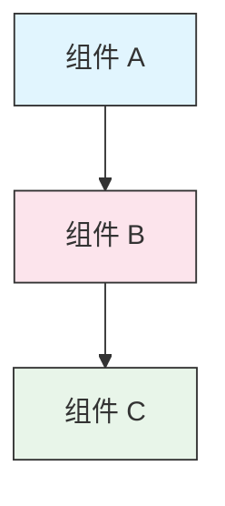

<picture>
  <source media="(prefers-color-scheme: dark)" srcset="resources/logos/claude-howto-logo-dark.svg">
  
</picture>

# 风格指南

> 为 Claude How To 贡献内容时的规范和格式规则。遵循本指南以保持内容一致、专业且易于维护。

---

## 目录

- [文件和文件夹命名](#文件和文件夹命名)
- [文档结构](#文档结构)
- [标题](#标题)
- [文本格式](#文本格式)
- [列表](#列表)
- [表格](#表格)
- [代码块](#代码块)
- [链接和交叉引用](#链接和交叉引用)
- [图表](#图表)
- [Emoji 使用](#emoji-使用)
- [YAML 前置元数据（Frontmatter）](#yaml-前置元数据)
- [图片和媒体](#图片和媒体)
- [语气和语调](#语气和语调)
- [提交消息](#提交消息)
- [作者检查清单](#作者检查清单)

---

## 文件和文件夹命名

### 课程文件夹

课程文件夹使用**两位数字前缀**加上**短横线连接**的描述符：

```
01-slash-commands/
02-memory/
03-skills/
04-subagents/
05-mcp/
```

数字反映从初级到高级的学习路径顺序。

### 文件名

| 类型 | 规范 | 示例 |
|------|------|------|
| **课程 README** | `README.md` | `01-slash-commands/README.md` |
| **功能文件** | 短横线连接 `.md` | `code-reviewer.md`, `generate-api-docs.md` |
| **Shell 脚本** | 短横线连接 `.sh` | `format-code.sh`, `validate-input.sh` |
| **配置文件** | 标准名称 | `.mcp.json`, `settings.json` |
| **记忆文件** | 作用域前缀 | `project-CLAUDE.md`, `personal-CLAUDE.md` |
| **顶级文档** | 大写 `.md` | `CATALOG.md`, `QUICK_REFERENCE.md`, `CONTRIBUTING.md` |
| **图片资源** | 短横线连接 | `pr-slash-command.png`, `claude-howto-logo.svg` |

### 规则

- 所有文件和文件夹名称使用**小写**（顶级文档如 `README.md`、`CATALOG.md` 除外）
- 使用**短横线**（`-`）作为单词分隔符，永远不要使用下划线或空格
- 保持名称具有描述性但简洁

---

## 文档结构

### 根 README

根 `README.md` 遵循以下顺序：

1. Logo（带暗色/亮色模式变体的 `<picture>` 元素）
2. H1 标题
3. 引言引用块（一行价值主张）
4. "为什么选择本指南？"章节，含对比表格
5. 水平分割线 (`---`)
6. 目录
7. 功能目录
8. 快速导航
9. 学习路径
10. 功能章节
11. 开始使用
12. 最佳实践 / 故障排除
13. 贡献 / 许可证

### 课程 README

每个课程 `README.md` 遵循以下顺序：

1. H1 标题（如 `# 斜杠命令`）
2. 简要概述段落
3. 快速参考表（可选）
4. 架构图（Mermaid）
5. 详细章节（H2）
6. 实际示例（编号，4-6 个示例）
7. 最佳实践（推荐和避免表格）
8. 故障排除
9. 相关指南 / 官方文档
10. 文档元数据页脚

### 功能/示例文件

独立功能文件（如 `optimize.md`、`pr.md`）：

1. YAML 前置元数据（如适用）
2. H1 标题
3. 用途 / 描述
4. 使用说明
5. 代码示例
6. 自定义提示

### 章节分隔符

使用水平分割线 (`---`) 分隔文档的主要区域：

```markdown
---

## 新的主要章节
```

将其放置在引言引用块之后以及文档逻辑上不同部分之间。

---

## 标题

### 层级

| 级别 | 用途 | 示例 |
|------|------|------|
| `#` H1 | 页面标题（每个文档一个） | `# 斜杠命令` |
| `##` H2 | 主要章节 | `## 最佳实践` |
| `###` H3 | 子章节 | `### 添加技能` |
| `####` H4 | 子子章节（少见） | `#### 配置选项` |

### 规则

- **每个文档只有一个 H1** — 仅页面标题
- **不要跳过层级** — 不要从 H2 跳到 H4
- **保持标题简洁** — 目标 2-5 个词
- **使用句子大小写** — 仅大写第一个词和专有名词（例外：功能名称保持原样）
- **仅在根 README 的章节标题中添加 emoji 前缀**（参见 [Emoji 使用](#emoji-使用)）

---

## 文本格式

### 强调

| 样式 | 使用场景 | 示例 |
|------|---------|------|
| **粗体** (`**文本**`) | 关键术语、表格标签、重要概念 | `**安装**:` |
| *斜体* (`*文本*`) | 技术术语首次使用、书籍/文档标题 | `*前置元数据*` |
| `代码` (`` `文本` ``) | 文件名、命令、配置值、代码引用 | `` `CLAUDE.md` `` |

### 提示块引用

使用带粗体前缀的引用块标注重要提示：

```markdown
> **注意**: 自定义斜杠命令自 v2.0 起已合并到技能中。

> **重要**: 永远不要提交 API 密钥或凭据。

> **提示**: 将记忆与技能结合使用以获得最大效果。
```

支持的提示类型: **注意**、**重要**、**提示**、**警告**。

### 段落

- 保持段落简短（2-4 句）
- 段落之间添加空行
- 以关键要点开头，然后提供上下文
- 解释"为什么"而不仅仅是"是什么"

---

## 列表

### 无序列表

使用短横线 (`-`) 和 2 个空格缩进进行嵌套：

```markdown
- 第一项
- 第二项
  - 嵌套项
  - 另一个嵌套项
    - 深层嵌套（避免超过 3 层）
- 第三项
```

### 有序列表

使用编号列表表示顺序步骤、指令和排名项目：

```markdown
1. 第一步
2. 第二步
   - 子要点细节
   - 另一个子要点
3. 第三步
```

### 描述性列表

使用粗体标签表示键值样式列表：

```markdown
- **性能瓶颈** - 识别 O(n^2) 操作、低效循环
- **内存泄漏** - 查找未释放资源、循环引用
- **算法改进** - 建议更好的算法或数据结构
```

### 规则

- 保持一致的缩进（每层 2 个空格）
- 在列表前后添加空行
- 保持列表项结构并行（全部以动词开头，或全部为名词等）
- 避免嵌套超过 3 层

---

## 表格

### 标准格式

```markdown
| 第 1 列 | 第 2 列 | 第 3 列 |
|---------|---------|---------|
| 数据    | 数据    | 数据    |
```

### 常见表格模式

**功能对比（3-4 列）:**

```markdown
| 功能 | 调用方式 | 持久性 | 最适用于 |
|------|---------|--------|---------|
| **斜杠命令** | 手动 (`/cmd`) | 仅当前会话 | 快速快捷方式 |
| **记忆** | 自动加载 | 跨会话 | 长期学习 |
```

**推荐和避免:**

```markdown
| 推荐 | 避免 |
|------|------|
| 使用描述性名称 | 使用模糊名称 |
| 保持文件专注 | 在单个文件中放入过多内容 |
```

**快速参考:**

```markdown
| 方面 | 详情 |
|------|------|
| **用途** | 生成 API 文档 |
| **作用域** | 项目级 |
| **复杂度** | 中级 |
```

### 规则

- 当表头是行标签（第一列）时使用**粗体**
- 在源码中对齐管道符以提高可读性（可选但推荐）
- 保持单元格内容简洁；使用链接提供详情
- 在单元格内对命令和文件路径使用 `代码格式`

---

## 代码块

### 语言标签

始终指定语言标签以实现语法高亮：

| 语言 | 标签 | 用于 |
|------|------|------|
| Shell | `bash` | CLI 命令、脚本 |
| Python | `python` | Python 代码 |
| JavaScript | `javascript` | JS 代码 |
| TypeScript | `typescript` | TS 代码 |
| JSON | `json` | 配置文件 |
| YAML | `yaml` | 前置元数据、配置 |
| Markdown | `markdown` | Markdown 示例 |
| SQL | `sql` | 数据库查询 |
| 纯文本 | （无标签） | 预期输出、目录树 |

### 规范

```bash
# 解释命令功能的注释
claude mcp add notion --transport http https://mcp.notion.com/mcp
```

- 在非显而易见的命令前添加**注释行**
- 确保所有示例**可复制粘贴直接使用**
- 在相关时展示**简单和高级**两个版本
- 在有助于理解时包含**预期输出**（使用无标签代码块）

### 安装代码块

使用以下模式编写安装说明：

```bash
# 将文件复制到你的项目
cp 01-slash-commands/*.md .claude/commands/
```

### 多步骤工作流

```bash
# 步骤 1: 创建目录
mkdir -p .claude/commands

# 步骤 2: 复制模板
cp 01-slash-commands/*.md .claude/commands/

# 步骤 3: 验证安装
ls .claude/commands/
```

---

## 链接和交叉引用

### 内部链接（相对路径）

所有内部链接使用相对路径：

```markdown
[斜杠命令](01-slash-commands/)
[技能指南](03-skills/)
[记忆架构](02-memory/#记忆架构)
```

从课程文件夹返回根目录或兄弟目录：

```markdown
[返回主指南](../README.md)
[相关: 技能](../03-skills/)
```

### 外部链接（绝对路径）

使用完整 URL 和描述性锚文本：

```markdown
[Anthropic 官方文档](https://code.claude.com/docs/en/overview)
```

- 永远不要使用"点击这里"或"此链接"作为锚文本
- 使用脱离上下文也有意义的描述性文本

### 章节锚点

使用 GitHub 风格的锚点链接到同一文档内的章节：

```markdown
[功能目录](#-feature-catalog)
[最佳实践](#best-practices)
```

### 相关指南模式

在课程末尾添加相关指南章节：

```markdown
## 相关指南

- [斜杠命令](../01-slash-commands/) - 快速快捷方式
- [记忆](../02-memory/) - 持久化上下文
- [技能](../03-skills/) - 可复用能力
```

---

## 图表

### Mermaid

所有图表使用 Mermaid。支持的类型：

- `graph TB` / `graph LR` — 架构、层级、流程
- `sequenceDiagram` — 交互流程
- `timeline` — 时间序列

### 样式规范

使用样式块应用一致的颜色：



**调色板:**

| 颜色 | 十六进制 | 用于 |
|------|---------|------|
| 浅蓝 | `#e1f5fe` | 主要组件、输入 |
| 浅粉 | `#fce4ec` | 处理、中间件 |
| 浅绿 | `#e8f5e9` | 输出、结果 |
| 浅黄 | `#fff9c4` | 配置、可选 |
| 浅紫 | `#f3e5f5` | 面向用户、UI |

### 规则

- 使用 `["标签文本"]` 作为节点标签（支持特殊字符）
- 使用 `<br/>` 在标签内换行
- 保持图表简单（最多 10-12 个节点）
- 在图表下方添加简短文字描述以提高可访问性
- 层级图使用自上而下 (`TB`)，工作流使用从左到右 (`LR`)

---

## Emoji 使用

### 使用 Emoji 的场景

Emoji 仅**少量且有目的地使用** — 仅在特定上下文中：

| 上下文 | Emoji | 示例 |
|--------|-------|------|
| 根 README 章节标题 | 分类图标 | `## 学习路径` |
| 技能水平指示器 | 彩色圆圈 | 入门，中级，高级 |
| 推荐和避免 | 勾号/叉号 | 推荐这样做，避免这样做 |
| 复杂度评级 | 星星 | 中等难度 |

### 规则

- **永远不要在正文**或段落中使用 emoji
- **仅在根 README 的标题中使用 emoji**（不在课程 README 中）
- **不要添加装饰性 emoji** — 每个 emoji 都应传达含义
- 保持 emoji 使用与上表一致

---

## YAML 前置元数据

### 功能文件（技能、命令、代理）

```yaml
---
name: unique-identifier
description: What this feature does and when to use it
allowed-tools: Bash, Read, Grep
---
```

### 可选字段

```yaml
---
name: my-feature
description: Brief description
argument-hint: "[file-path] [options]"
allowed-tools: Bash, Read, Grep, Write, Edit
model: opus                        # opus, sonnet, or haiku
disable-model-invocation: true     # 仅用户调用
user-invocable: false              # 对用户菜单隐藏
context: fork                      # 在隔离的子代理中运行
agent: Explore                     # context: fork 的代理类型
---
```

### 规则

- 将前置元数据放在文件的最顶部
- `name` 字段使用**短横线连接**
- `description` 保持一句话
- 只包含需要的字段

---

## 图片和媒体

### Logo 模式

所有以 logo 开头的文档使用 `<picture>` 元素支持暗色/亮色模式：

```html
<picture>
  <source media="(prefers-color-scheme: dark)" srcset="resources/logos/claude-howto-logo-dark.svg">
  
</picture>
```

### 截图

- 存储在相关课程文件夹中（如 `01-slash-commands/pr-slash-command.png`）
- 使用短横线连接的文件名
- 包含描述性的 alt 文本
- 图表优先使用 SVG，截图使用 PNG

### 规则

- 始终为图片提供 alt 文本
- 保持图片文件大小合理（PNG 小于 500KB）
- 使用相对路径引用图片
- 将图片存储在引用它们的文档所在目录中，或在 `assets/` 中存放共享图片

---

## 语气和语调

### 写作风格

- **专业但平易近人** — 技术准确性与通俗易懂兼顾
- **主动语态** — "创建一个文件"而非"应该创建一个文件"
- **直接指令** — "运行此命令"而非"你可能想运行此命令"
- **对初学者友好** — 假设读者是 Claude Code 的新手，但不是编程新手

### 内容原则

| 原则 | 示例 |
|------|------|
| **展示而非讲述** | 提供可运行的示例，而非抽象描述 |
| **渐进式复杂度** | 从简单开始，在后续章节中增加深度 |
| **解释"为什么"** | "使用记忆来...因为..."而非仅仅"使用记忆来..." |
| **可复制粘贴** | 每个代码块都应该可以直接粘贴使用 |
| **真实上下文** | 使用实际场景，而非人为构造的示例 |

### 词汇

- 使用"Claude Code"（而非"Claude CLI"或"该工具"）
- 使用"技能"（而非"自定义命令"——旧术语）
- 使用"课程"或"指南"表示编号章节
- 使用"示例"表示单个功能文件

---

## 提交消息

遵循[约定式提交](https://www.conventionalcommits.org/)：

```
type(scope): description
```

### 类型

| 类型 | 用于 |
|------|------|
| `feat` | 新功能、示例或指南 |
| `fix` | Bug 修复、更正、断链 |
| `docs` | 文档改进 |
| `refactor` | 不改变行为的重构 |
| `style` | 仅格式更改 |
| `test` | 测试添加或更改 |
| `chore` | 构建、依赖、CI |

### 作用域

使用课程名称或文件区域作为作用域：

```
feat(slash-commands): Add API documentation generator
docs(memory): Improve personal preferences example
fix(README): Correct table of contents link
docs(skills): Add comprehensive code review skill
```

---

## 文档元数据页脚

课程 README 以元数据块结束：

```markdown
---
**最后更新**: 2026 年 3 月
**Claude Code 版本**: 2.1+
**兼容模型**: Claude Sonnet 4.6, Claude Opus 4.6, Claude Haiku 4.5
```

- 使用"月份 + 年份"格式（如"2026 年 3 月"）
- 功能变更时更新版本
- 列出所有兼容模型

---

## 作者检查清单

提交内容前请验证：

- [ ] 文件/文件夹名称使用短横线连接
- [ ] 文档以 H1 标题开头（每个文件一个）
- [ ] 标题层级正确（无跳级）
- [ ] 所有代码块有语言标签
- [ ] 代码示例可复制粘贴直接使用
- [ ] 内部链接使用相对路径
- [ ] 外部链接有描述性锚文本
- [ ] 表格格式正确
- [ ] Emoji 遵循标准集（如果使用的话）
- [ ] Mermaid 图表使用标准调色板
- [ ] 无敏感信息（API 密钥、凭据）
- [ ] YAML 前置元数据有效（如适用）
- [ ] 图片有 alt 文本
- [ ] 段落简短且专注
- [ ] 相关指南章节链接到相关课程
- [ ] 提交消息遵循约定式提交格式
