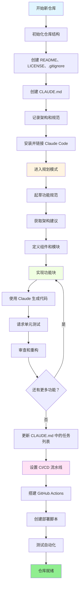
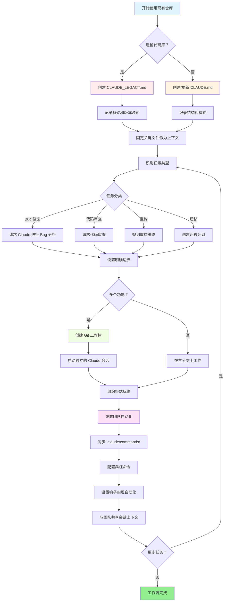

<picture>
  <source media="(prefers-color-scheme: dark)" srcset="resources/logos/claude-howto-logo-dark.svg">
  
</picture>

# 优质资源列表

## 官方文档

| 资源 | 描述 | 链接 |
|------|------|------|
| Claude Code 文档 | 官方 Claude Code 文档 | [code.claude.com/docs/en/overview](https://code.claude.com/docs/en/overview) |
| Anthropic 文档 | 完整的 Anthropic 文档 | [docs.anthropic.com](https://docs.anthropic.com) |
| MCP 协议 | 模型上下文协议（MCP）规范 | [modelcontextprotocol.io](https://modelcontextprotocol.io) |
| MCP 服务器 | 官方 MCP 服务器实现 | [github.com/modelcontextprotocol/servers](https://github.com/modelcontextprotocol/servers) |
| Anthropic Cookbook | 代码示例和教程 | [github.com/anthropics/anthropic-cookbook](https://github.com/anthropics/anthropic-cookbook) |
| Claude Code 技能（Skill） | 社区技能仓库 | [github.com/anthropics/skills](https://github.com/anthropics/skills) |
| 代理（Agent）团队 | 多代理协调与协作 | [code.claude.com/docs/en/agent-teams](https://code.claude.com/docs/en/agent-teams) |
| 定时任务 | 使用 /loop 和 cron 的周期性任务 | [code.claude.com/docs/en/scheduled-tasks](https://code.claude.com/docs/en/scheduled-tasks) |
| Chrome 集成 | 浏览器自动化 | [code.claude.com/docs/en/chrome](https://code.claude.com/docs/en/chrome) |
| 键位绑定 | 键盘快捷键自定义 | [code.claude.com/docs/en/keybindings](https://code.claude.com/docs/en/keybindings) |
| 桌面应用 | 原生桌面应用程序 | [code.claude.com/docs/en/desktop](https://code.claude.com/docs/en/desktop) |
| 远程控制 | 远程会话控制 | [code.claude.com/docs/en/remote-control](https://code.claude.com/docs/en/remote-control) |
| Auto 模式 | 自动权限管理 | [code.claude.com/docs/en/permissions](https://code.claude.com/docs/en/permissions) |
| 频道 | 多频道通信 | [code.claude.com/docs/en/channels](https://code.claude.com/docs/en/channels) |
| 语音听写 | Claude Code 的语音输入 | [code.claude.com/docs/en/voice-dictation](https://code.claude.com/docs/en/voice-dictation) |

## Anthropic 工程博客

| 文章 | 描述 | 链接 |
|------|------|------|
| MCP 代码执行 | 如何使用代码执行解决 MCP 上下文膨胀问题——减少 98.7% 的令牌（Token）用量 | [anthropic.com/engineering/code-execution-with-mcp](https://www.anthropic.com/engineering/code-execution-with-mcp) |

---

## 30 分钟掌握 Claude Code

_视频_: https://www.youtube.com/watch?v=6eBSHbLKuN0

_**所有技巧**_
- **探索高级功能和快捷键**
  - 定期查看 Claude 发布说明中的新代码编辑和上下文功能。
  - 学习键盘快捷键，快速在聊天、文件和编辑器视图之间切换。

- **高效设置**
  - 使用清晰的名称/描述创建项目特定的会话，便于后续检索。
  - 固定最常用的文件或文件夹，使 Claude 随时可以访问。
  - 设置 Claude 的集成（如 GitHub、常用 IDE）以简化编码流程。

- **高效的代码库问答**
  - 向 Claude 询问关于架构、设计模式和特定模块的详细问题。
  - 在问题中使用文件和行号引用（如"What does the logic in `app/models/user.py` accomplish?"）。
  - 对于大型代码库，提供摘要或清单帮助 Claude 聚焦。
  - **示例提示词（Prompt）**: _"Can you explain the authentication flow implemented in src/auth/AuthService.ts:45-120? How does it integrate with the middleware in src/middleware/auth.ts?"_

- **代码编辑和重构**
  - 使用内联注释或代码块中的请求获取专注的编辑（"Refactor this function for clarity"）。
  - 请求前后对比。
  - 在重大编辑后让 Claude 生成测试或文档以保证质量。
  - **示例提示词**: _"Refactor the getUserData function in api/users.js to use async/await instead of promises. Show me a before/after comparison and generate unit tests for the refactored version."_

- **上下文管理**
  - 将粘贴的代码/上下文限制为仅与当前任务相关的内容。
  - 使用结构化提示词（"Here's file A, here's function B, my question is X"）以获得最佳效果。
  - 在提示词窗口中移除或折叠大文件以避免超出上下文限制。
  - **示例提示词**: _"Here's the User model from models/User.js and the validateUser function from utils/validation.js. My question is: how can I add email validation while maintaining backward compatibility?"_

- **集成团队工具**
  - 将 Claude 会话连接到团队的仓库和文档。
  - 使用内置模板或为重复的工程任务创建自定义模板。
  - 通过与队友共享会话记录和提示词进行协作。

- **提升性能**
  - 给 Claude 清晰的、目标导向的指令（如 "Summarize this class in five bullet points"）。
  - 从上下文窗口（Context Window）中删除不必要的注释和样板代码。
  - 如果 Claude 的输出偏离方向，重置上下文或重新表述问题以获得更好的对齐。
  - **示例提示词**: _"Summarize the DatabaseManager class in src/db/Manager.ts in five bullet points, focusing on its main responsibilities and key methods."_

- **实际使用示例**
  - 调试：粘贴错误和堆栈跟踪，然后询问可能的原因和修复方案。
  - 测试生成：为复杂逻辑请求属性测试、单元测试或集成测试。
  - 代码审查：让 Claude 识别风险更改、边界情况或代码坏味道。
  - **示例提示词**:
    - _"I'm getting this error: 'TypeError: Cannot read property 'map' of undefined at line 42 in components/UserList.jsx'. Here's the stack trace and the relevant code. What's causing this and how can I fix it?"_
    - _"Generate comprehensive unit tests for the PaymentProcessor class, including edge cases for failed transactions, timeouts, and invalid inputs."_
    - _"Review this pull request diff and identify potential security issues, performance bottlenecks, and code smells."_

- **工作流自动化**
  - 使用 Claude 提示词脚本化重复任务（如格式化、清理和重复重命名）。
  - 使用 Claude 根据代码差异起草 PR 描述、发布说明或文档。
  - **示例提示词**: _"Based on the git diff, create a detailed PR description with a summary of changes, list of modified files, testing steps, and potential impacts. Also generate release notes for version 2.3.0."_

**提示**: 为获得最佳效果，结合使用这些实践——首先固定关键文件并总结你的目标，然后使用聚焦的提示词和 Claude 的重构工具逐步改进你的代码库和自动化流程。

**使用 Claude Code 的推荐工作流**

### 使用 Claude Code 的推荐工作流

#### 对于新仓库

1. **初始化仓库和 Claude 集成**
   - 使用基本结构设置新仓库：README、LICENSE、.gitignore、根配置。
   - 创建 `CLAUDE.md` 文件，描述架构、高级目标和编码规范。
   - 安装 Claude Code 并将其链接到你的仓库，用于代码建议、测试脚手架和工作流自动化。

2. **使用规划模式和规范**
   - 使用规划模式（`shift-tab` 或 `/plan`）在实现功能前起草详细规范。
   - 向 Claude 请求架构建议和初始项目布局。
   - 保持清晰的、目标导向的提示词序列——请求组件大纲、主要模块和职责划分。

3. **迭代开发和审查**
   - 以小块方式实现核心功能，提示 Claude 进行代码生成、重构和文档编写。
   - 在每次增量后请求单元测试和示例。
   - 在 CLAUDE.md 中维护一个持续的任务列表。

4. **自动化 CI/CD 和部署**
   - 使用 Claude 搭建 GitHub Actions、npm/yarn 脚本或部署工作流。
   - 通过更新 CLAUDE.md 并请求相应的命令/脚本来轻松调整流水线。

#### 对于现有仓库

1. **仓库和上下文设置**
   - 添加或更新 `CLAUDE.md`，记录仓库结构、编码模式和关键文件。对于遗留仓库，使用 `CLAUDE_LEGACY.md` 覆盖框架、版本映射、指令、Bug 和升级说明。
   - 固定或高亮 Claude 应使用的主要文件作为上下文。

2. **上下文化的代码问答**
   - 向 Claude 请求代码审查、Bug 解释、重构或迁移计划，引用具体文件/函数。
   - 给 Claude 明确的边界（如"仅修改这些文件"或"不添加新依赖"）。

3. **分支、工作树（Worktree）和多会话管理**
   - 使用多个 Git 工作树进行隔离的功能开发或 Bug 修复，并为每个工作树启动独立的 Claude 会话。
   - 按分支或功能组织终端标签/窗口，实现并行工作流。

4. **团队工具和自动化**
   - 通过 `.claude/commands/` 同步自定义命令，确保跨团队的一致性。
   - 通过 Claude 的斜杠命令（Slash Command）或钩子（Hook）自动化重复任务、PR 创建和代码格式化。
   - 与团队成员共享会话和上下文，进行协作故障排除和审查。

**提示**:
- 每个新功能或修复都从规范和规划模式提示词开始。
- 对于遗留和复杂仓库，在 CLAUDE.md/CLAUDE_LEGACY.md 中存储详细指导。
- 给出清晰、聚焦的指令，将复杂工作分解为多阶段计划。
- 定期清理会话、修剪上下文并移除已完成的工作树以避免混乱。

这些步骤涵盖了在新仓库和现有代码库中使用 Claude Code 实现顺畅工作流的核心建议。

---

## 新功能和能力（2026 年 3 月）

### 关键功能资源

| 功能 | 描述 | 了解更多 |
|------|------|---------|
| **自动记忆（Memory）** | Claude 自动学习并跨会话记住你的偏好 | [记忆指南](02-memory/) |
| **远程控制** | 通过外部工具和脚本以编程方式控制 Claude Code 会话 | [高级功能](09-advanced-features/) |
| **Web 会话** | 通过基于浏览器的界面访问 Claude Code 进行远程开发 | [CLI 参考](10-cli/) |
| **桌面应用** | 具有增强 UI 的 Claude Code 原生桌面应用程序 | [Claude Code 文档](https://code.claude.com/docs/en/desktop) |
| **深度思考** | 通过 `Alt+T`/`Option+T` 或 `MAX_THINKING_TOKENS` 环境变量切换深度推理 | [高级功能](09-advanced-features/) |
| **权限模式（Permission Mode）** | 细粒度控制: default, acceptEdits, plan, auto, dontAsk, bypassPermissions | [高级功能](09-advanced-features/) |
| **7 层记忆** | 管理策略、项目、项目规则、用户、用户规则、本地、自动记忆 | [记忆指南](02-memory/) |
| **钩子事件** | 25 个事件: PreToolUse, PostToolUse, PostToolUseFailure, Stop, StopFailure, SubagentStart, SubagentStop, Notification, Elicitation 等 | [钩子指南](06-hooks/) |
| **代理团队** | 协调多个代理协作完成复杂任务 | [子代理（Subagent）指南](04-subagents/) |
| **定时任务** | 使用 `/loop` 和 cron 工具设置周期性任务 | [高级功能](09-advanced-features/) |
| **Chrome 集成** | 使用无头 Chromium 的浏览器自动化 | [高级功能](09-advanced-features/) |
| **键盘自定义** | 自定义键位绑定，包括连击序列 | [高级功能](09-advanced-features/) |
